# An intoduction to R:
<!--

Run Keeper Data - Boston, Nathan Yau (http://flowingdata.com/2014/02/05/where-people-run/)

 -->

## About
This is an intro to the R programming language which we will use throughout the rest of the course and hopefully you'll use when you leave UBC and start your lives in research, industry, and beyond!

##S2: Requirements:

* First: download and install [R](http://cran.stat.sfu.ca/) - make sure you download the right one for your system.
	* For Windows users, you can choose between 32-bit and 64-bit versions of R, you need to choose which one is right for your computer. If you're really unsure, then choose the 32-bit, BUT if you don't mind google searching "32-bit or 64-bit windows for <insert computer model here>" 
	* ***SUPER IMPORTANT for Windows***: We've noticed some issues with R and the packages if you install R and R studio to to the "C:\Program Files" which is the default option. 
		* Instead try to install R and RStudio on your "C:\" drive. If you have already installed R to your "C:\Program Files" and have been noticing problems, uninstall R and Rstudio and reinstall them in your "C:\" drive. 
* Second: download and install [R studio](https://www.rstudio.com/products/RStudio/#Desktop) (make sure to install R first!)

## Outline
<!-- START doctoc generated TOC please keep comment here to allow auto update -->
<!-- DON'T EDIT THIS SECTION, INSTEAD RE-RUN doctoc TO UPDATE -->

<!-- END doctoc generated TOC please keep comment here to allow auto update -->

## Why are we learning R?

Why are we using R after spending all that time learning Processing? Well, first I would go back to the fact that programming languages are like materials, each with a distinct qualities, benefits, and limitations. In this way, it doesn't make sense to say one language is better or worse than another, rather that  they are just different. So why learn R? Here's why I chose to introduce R in this course:

* **High Level Programming Language**: R is what we consider a high level programming language. With a few lines of code, you can do *a lot* of stuff which is super nice when we're learning.
* **Easy to setup and has a nice Integrated Development Environment** (IDE): R is nice because it sort of lives within itself - it is easy to download, install, and setup, it is cross platform (it can be used in Windows, Mac OS, etc), and has a nice IDE called RStudio which we will use to help us write our code.
* **Large user community**: Like Processing, R has a HUGE user community that has grown to include domains of all sorts. This means also if you have a specific question that most likely someone has already found the answer and posted it online. The New York Times Data team is using R (among other things), for example! 
* **Super handy packages**: Because of the large user community people have developed packages for doing all sorts of cool things. Want to make an interactive map? Bam! There's an R package for that. Want to make a hillshade of a DEM in R? There's a package for that too! You'll start to see that packages will be your best friend, so use your favorite search engine and find the right packages for you!
* **Nice plots**: R kicks ass for plotting - and this is a data visualization class after all. With one line of code you can already start looking at your data, add a few more and you already have something pretty to look at. As a way of exploring and displaying your data, R is a nice way to go. 
* **Local expertise**: Its always handy to have people around to help you if you get stuck. There are plenty of people teaching R at UBC and also some expert grad students and faculty in Geography. 
* **Open source mapping**: When we dive further into R we'll start to see that we can start to do some really fancy geoprocessing in R - Basically your own, free, GIS :) When you leave UBC and no longer have access to proprietary software, you'll be happy to know that you have the tools to continue mapping away. 

# Getting Started

Throughout this workshop, try your best to make connections between what you learned in the intro to Processing to what R has to offer. There are some fundamental differences you will begin to notice, but you'll really quickly begin to see the advantages (and disadvantages) of using R. 

***
## R Studio IDE:

This is the R studio IDE. We will use R studio as our environment for running our code, making our scripts, and viewing our plots. It's sort of like our Processing PDE, with the major difference being that R is an ***interpreted*** language meaning we can run our code line-by-line versus Processing which is ***compiled*** which means Processing runs all of the code at once. You'll see why this is advantages for working with and exploring data. Anyways, because of this key difference, R studio is setup to help us explore our data line-by-line.

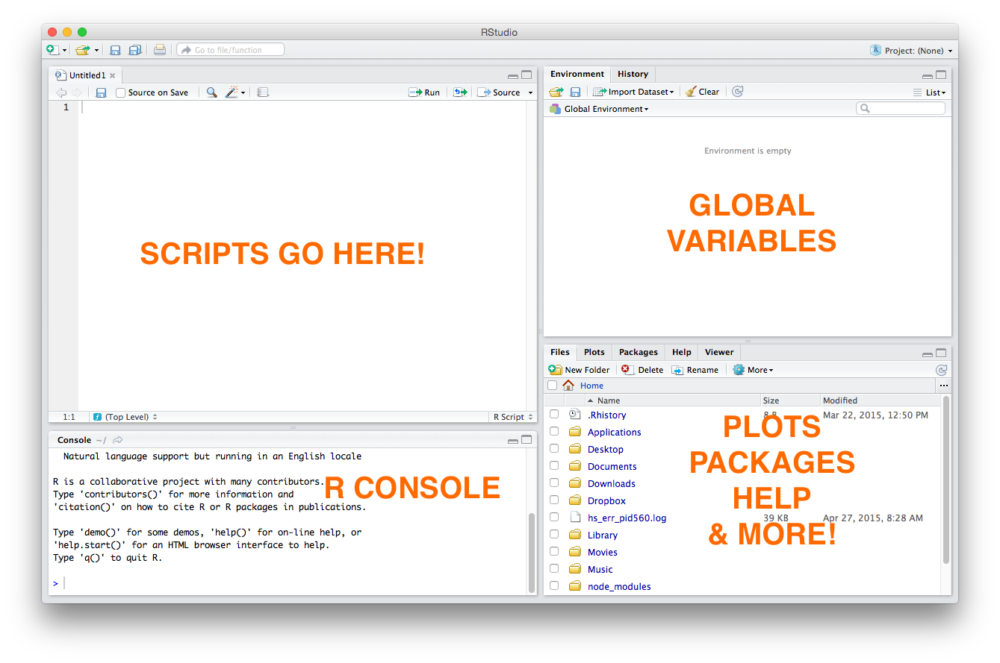

Your typical R studio IDE will look like the above and includes:

* **Script window**:A place to put your script (your entire code)
* **R console**: every line of code your run from your script will be run, evaluated and printed here. 
* **Global Environment**: This will show all the variables you declare and assign. The fancy thing about R studio is that it will tell you what kind of variable it is and even let your preview your data that you read in!
* **Plot, Packages, Help, & more**: Your plots will be shown here. Also you will be able to find packages and access R's help documentation.

***
## Focus Things:
+ Print everything - check that things are working and see how you change and manipulate data with functions and operations.
+ Plot everything - again, check that things are working and see how you change and manipulate data with functions and operations.
+ Help your classmates and friends - these will be the people you work with in the future - this is your network! The stronger you guys are and closer you are, the better connections you'll have. 
+ (on the above point) the success of this workshop will be how the group collectively grows and learns so work together!  

***
# Quick Syntax review:
##S5.1:Mathematical operators in R
 While most of the mathematical operators are the same as in Processing, there's a few differences. Let's check out those mathematical operators in R again.

	Operator		Description
	+				addition
	-				subtraction
	*				multiplication
	/				division
	^ or **			exponentiation
	x %% y			modulus (x mod y) 5%%2 is 1
	x %/% y			integer division 5%/%2 is 2

***
##S5.2:Logical Operators in R

	Operator		Description
	<				less than
	<=				less than or equal to
	>				greater than
	>=				greater than or equal to
	==				exactly equal to
	!=				not equal to
	!x				Not x
	x | y			x OR y
	x & y			x AND y
	isTRUE(x)		test if X is TRUE

See, not so different from what we already know. We added a few changes and new operators like the **exponentation** and the **modulo which takes two %%**.

***
# Gettin' down and di-R-ty: 
After learning about the fundamental building blocks of programming (and the data visualization pipeline), the goal now is to apply our understanding by taking code and data and producing visual output.

Instead of learning how to code R from the bottom up (which we did with Processing), we will go from the top down, meaning: we are going to learn by running examples and in the process train ourselves to deconstruct the patterns and functions we pick up along the way. 

But before we get into some examples, let's do a quick tour of running code in R, some R systax and data types!
***
## Your First R commands: "Hello World" 
Let's start by just running a few commands in the **R Console**. **To run a command in the console window**, simply: 

* type your statement and 
* **press [enter]**. 

In the console window, let's write 3 statements and run them. Here's the result of running the 3 examples below. 

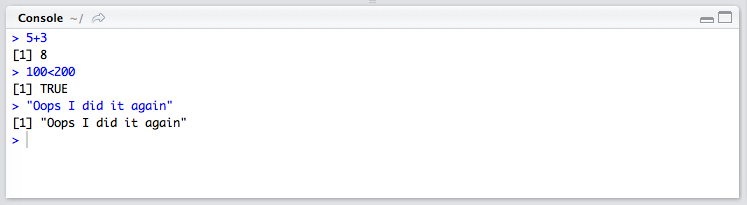

Try remixing these statements to produce different results:

* **Addition**

		5 + 3

* **Logical Operation**

		100 < 200

* **String**

		"Oops I did it again"

***
## Running code from the script window
Now that you've seen how R **reads**, **evaluates**, and **prints** the statements you feed it ***line-by-line***, . 

When running code line-by-line in the script window you:

1. Highlight the lines you want to run:

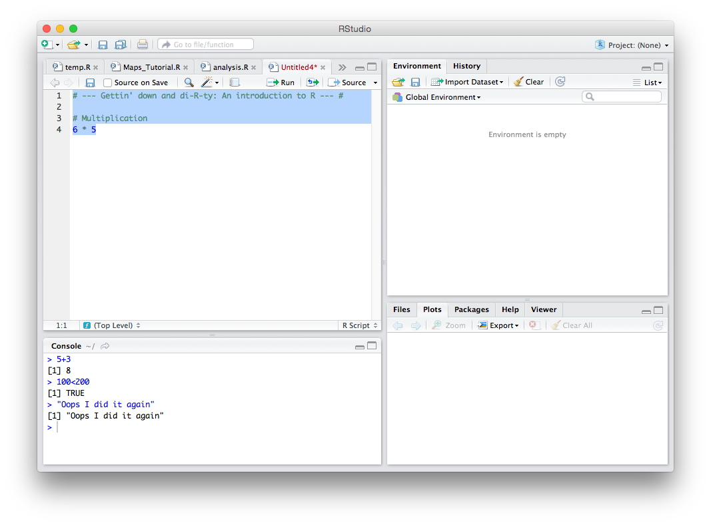

2. then "run the code" by pressing at the same time:
	* On **Mac**: 		[cmd] 	+ [enter]
	* On **Windows**:	[ctrl]	+ [enter]  

The results will then be "printed" to the console:

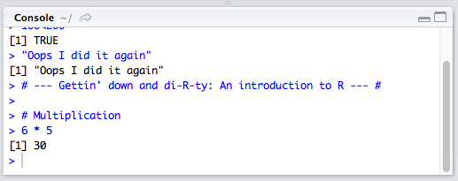

Now, to familiarize yourself with running code line-by-line from the script window, let's write another 3 statements, but this time **insert a comment** between each of the statements to neatly organize your code.

**NOTE: In R, comments are made by using the hash symbol (#)**

Try writing 3 examples of your own in the script window and seeing what is printed to the console:

* **Commenting**:

		# --- Gettin' Down and di-R-ty: an intro to R --- #
		# remember anything after the comment symbol is not evaluated

* **Multiplication**

		# Multiplication
		6 * 5

* **Exponentation**

		# Exponents
		5**2

* **String**

		# Strings
		"Hello World"

FYI, we can also use the *print()* function to print statements for us like this:

	# --- heres another way to print in R --- #
	print("Hello World!")
	print(5*10)
	print(10-3)

Run this and see that it return the same thing! Pretty neat stuff.

**NOTICE SOMETHING? WE DON'T NEED TO USE SEMI-COLONS (;) IN R!** This means that R doesn't use semi-colons to signify the end of a statement in contrast to Processing. Rather R uses line breaks to interpret each statement. Excited? Sad? Indifferent? In any case, just remember you **don't need semi-colons** to end statements in R. Are you beginning to see how programming languages all have their own flavor?

Now that you see how to run code line-by-line, let's dive further into some more exciting stuff.

***
## Variables, Data, & Plotting
Before we take a leap into a real-world example, it's worth noting a few fundamental things about R variables, data, and plotting.

### R Variables:
Unlike in Processing which is strongly typed, R is **losely typed** meaning that we don't need to specify the type of data that we are assigning to each variable - **notice we don't have to specify "int" or "float" or "String"** - R knows that type of data we are assigning!:

	# I'm an integer variable:
	x = 12
	print(x)
	
	# I'm a float variable:
	y = 16.5
	print(y)
	
	# I'm a string variable:
	z = "Hello"
	print(z)

### Fundamental R Data Types:
Here are a number of **fundamental R data types** that over time you will come to fully understand what they are, what makes them special, and when and where you would use them. For the 4 major data types below, all we need to now is that:

###Vectors (pretty much just a 1-D Array):
A vector in R is basically a collection of elements of the **same** datatype (e.g numeric, character, boolean.) - a 1-D array. We create a vector in R by using the **c()** function. The **c()** is short for "concatenate" which means "paste together or chain together in a series".
	
Here's 2 examples of a vectors: 
		
	# Here's some data of months of the year and the precipitation in Vancouver
	months = c(1, 2, 3, 4, 5, 6, 7, 8, 9 , 10, 11, 12)
	precipitation = c(186, 94, 118, 85, 60, 59, 38, 39, 48, 126, 183, 177)
	
And the cool thing is you can plot these bad boys:
	
plot the monthly precipitation data as a scatterplot:
		
	# A simple scatterplot:
	plot(x = months, y = precipitation)
		
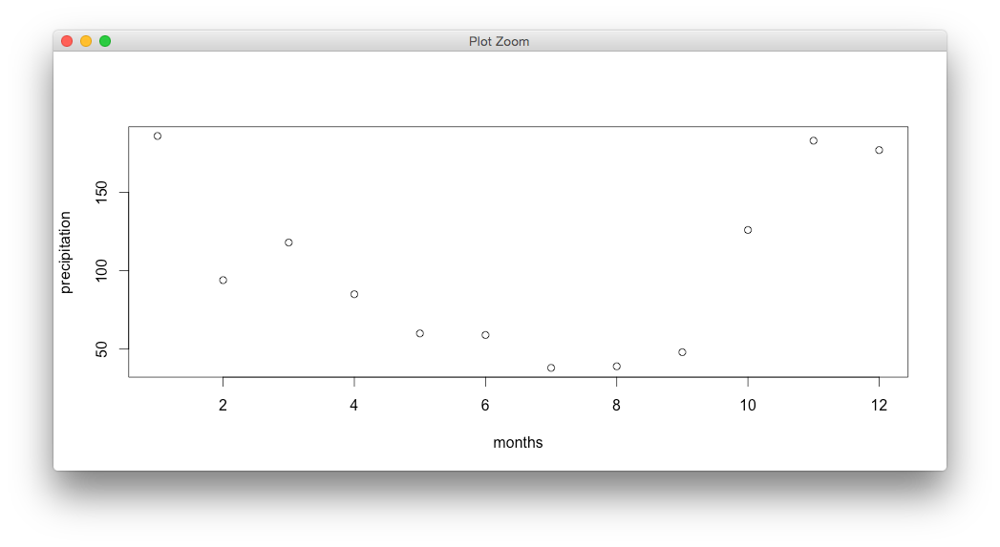
	
Or how about a line plot:
		
	# a line plot:
	plot(x = months,y = precipitation, type="l")
	
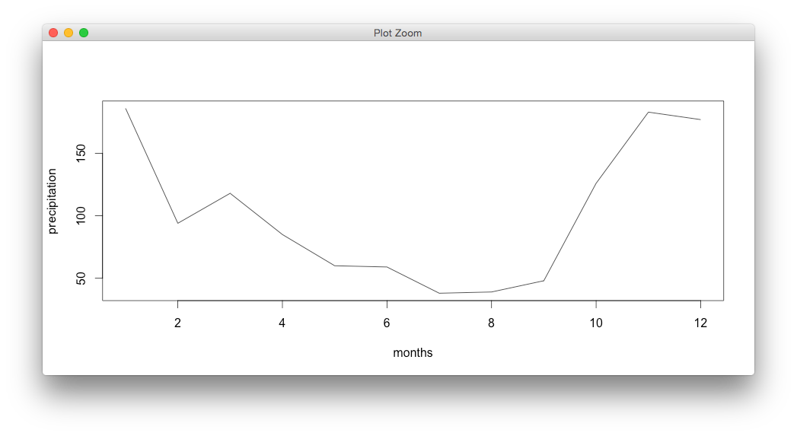
	
Or how about both lines and points:
		
	# scatterplot with lines - "b" stands for both:
	plot(x = months,y = precipitation, type="b")

Or how about a barplot:
		
	# plot it as a bar plot
	barplot(height = precipitation, names.arg = months)
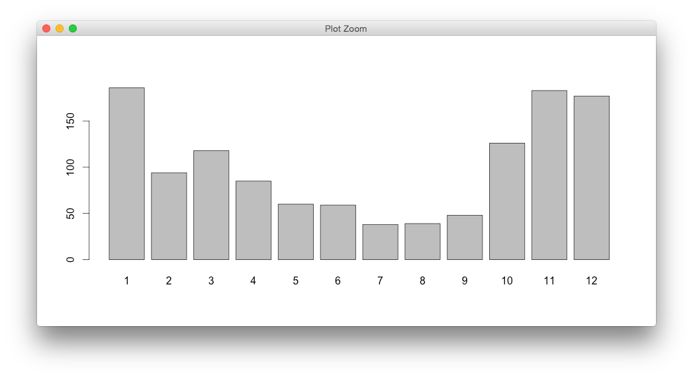
	
How easy and great is that? Sure sure, you're probably thinking "This is lame, I could do this in Excel" - but what if you had to make these graphs for every year in Vancouver since 1965? You could write a *loop* to automate that in R instead of clicking over and over again in Excel... AND if you needed to change a color or an axis label, you could just run your script again... just sayin'.
	
### Lists
An R list is a collection of elements (similar to a vector) BUT the key difference is that a list can contain different data types. Lists can be created by using the **list()** function and filling in values to be stored in the list. The key differene between vectors and lists is that **lists are not recursive**.
	
Here's an example of a list of all the same values:

	# Hey I'm a list:
	my_list = list(3, 6, 9, 12,15)

Here's a list of lists of mixed data types:

	# ---- a list of lists ---- #
	twitterLikes = list( 
	    Ellie = list(
	            Handle = "@smellyEllie", 
	            Posts = 134,
	            Location = "London, UK",
	            Description = "Maps are my lyfe"
	            ),
	    Joey = list(
	            Handle = "@leejoeyk", 
	            Posts = 365,
	            Location = "San Francisco, BC",
	            Description = "Maps are my lyfe"
	            ),
	    Sally = list(
	            Handle = "@sallyseashore", 
	            Posts = 15,
	            Location = "Vancouver, BC",
	            Description = "Loving Maps since day 1")
	)
	print(twitterLikes)

As you can see, depending on your data, this could be useful way of organizing and structuring your data. Looking kind of like Javascript Object Notation (JSON) with those keys and values, eh? 
		
### Dataframes

A dataframe is essentially data in a tabular form (think an excel spreadsheet) - it is composed of rows and columns of equal length. Each column is a vector ( aka 1-D array), meaning it contains all of the same data type (except for the header row) and is recursive, meaning that we can apply functions and mathematical operations on each column. Holy guacamole, does this mean R is really great at processing tabular data like excel sheets, csv files, and maybe even shapefiles? Yes! That is exactly right!

Very generally, dataframes are composed of vectors, which are like each column. OH! That means we can take our**month** and **precipitation** data and create a data frame?! yes! All we have to do is use the **data.frame()** function:
	
A dataframe of the rain data:

	# Here's some data of months of the year and the precipitation in Vancouver
	months = c(1, 2, 3, 4, 5, 6, 7, 8, 9 , 10, 11, 12)
	precipitation = c(186, 94, 118, 85, 60, 59, 38, 39, 48, 126, 183, 177)

	# rain dataframe
	rain_data = data.frame(months, precipitation)
	print(rain_data)

This gives us a nice tabular dataset :)

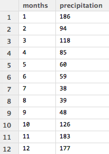

We use R's selector operator ($) to select each column:

	# select the precpitation column and calculate the annual average
	mean_precip = mean( rain_data$precipitation )
	print(mean_precip)

And we see that the mean precipitation in Vancouver is **101.0833 mm**

Say, we wanted to plot the annual average on top of the monthly values, we could do something like this:

	# create the plot:
	plot(x = rain_data$month, y = rain_data$precipitation, type = "b" )
	
	# add the mean line:
	abline(h= mean_precip)

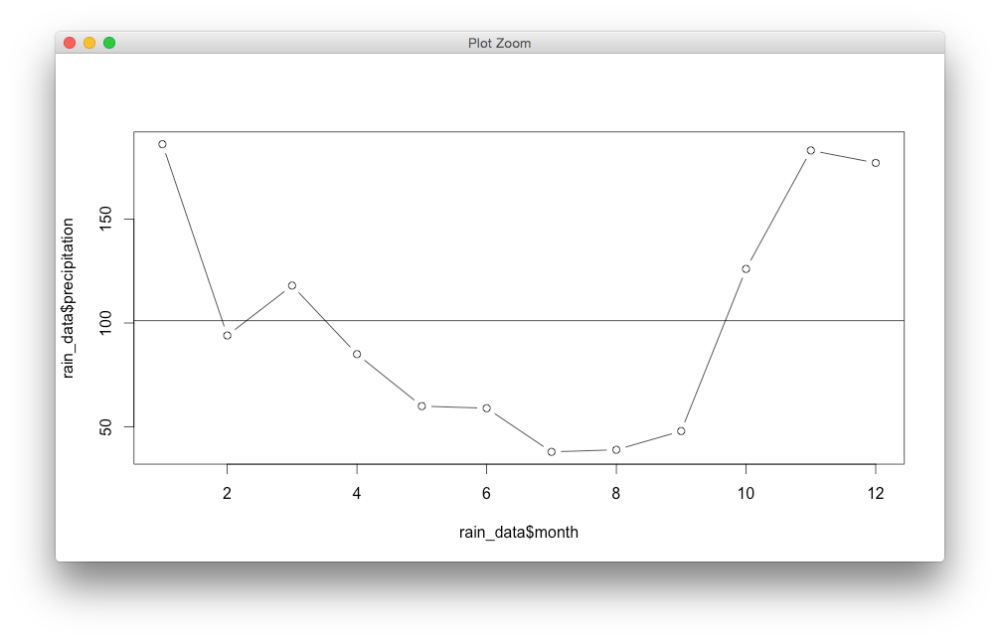

**NOTE: We usually won't be making our own dataframes, but rather reading them in the form of delimited text files like .csv's .xls, .tsv, .dat, etc. **

### Matrices:
Think of matrices as a raster or bitmap image. While the x and y dimensions can be different (e.g. like a photograph) all the columns must be the same data type.

As a quick example, let's use one of R's preloaded datasets - a matrix (e.g. raster) of Auckland's Maunga Whau Volcano:

	# store the volcano data to a variable:
	cano = volcano
	print(cano)

Whoa! we get a bunch of print outs that essentially show this structure/numbers which represent the topography of this volcano:
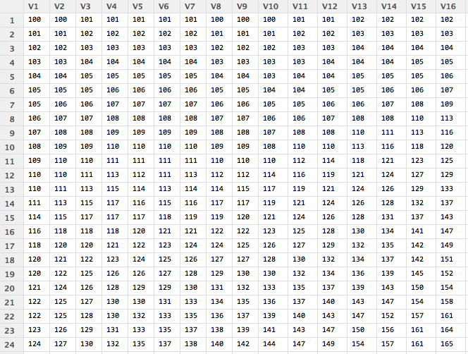

Now let's plot it, but instead of using **plot()** let's use the **image()** function:

	# image() fuction to plot the cano
	image(cano)

Wow! Such colors!

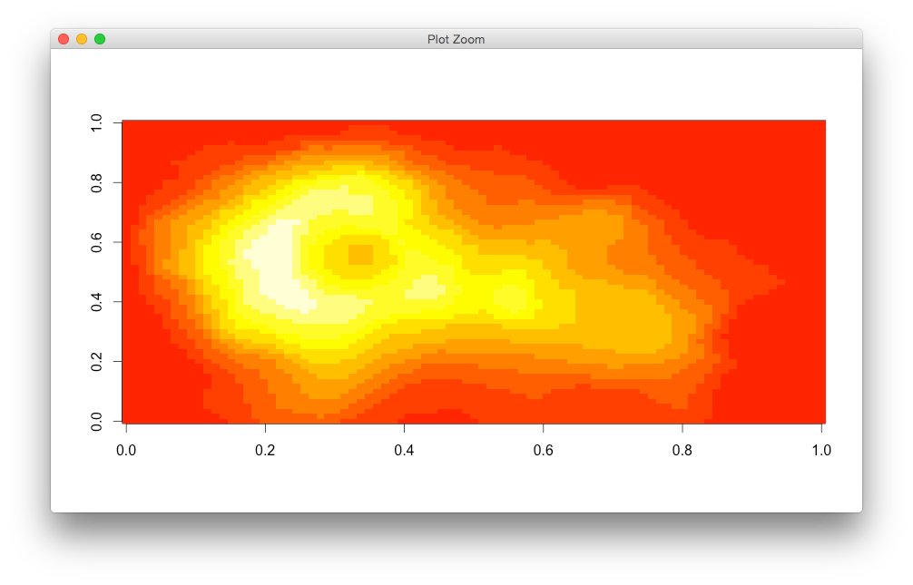

What other goodies can we plot? How about some contours?

	# contour lines of matrix
	contour(cano)

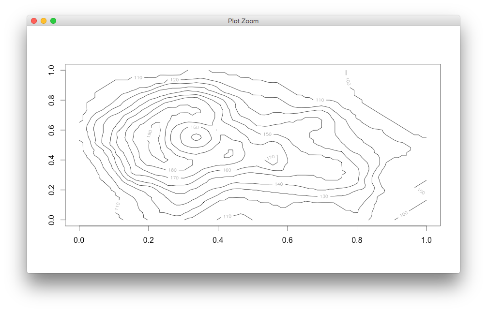

And believe it or not, enter the 3rd dimension:

	# Get some perspective
	persp(cano, expand = 0.3, phi=35, theta=10)

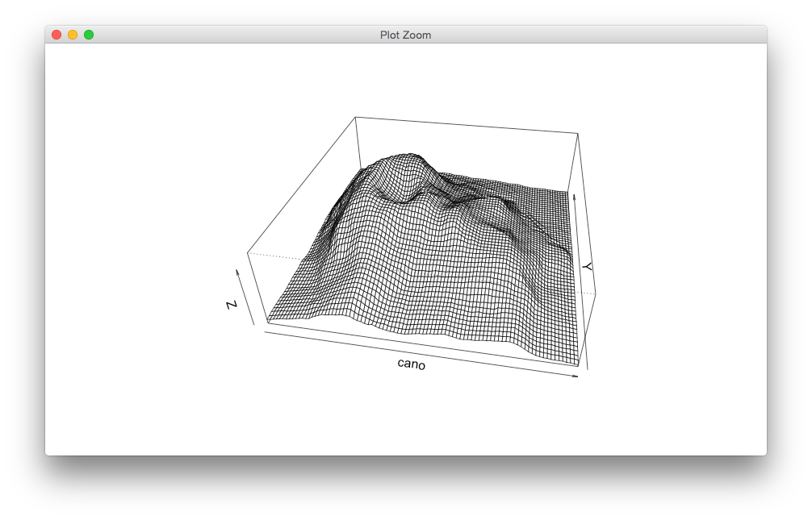

***
## Reading Dataframes from files:
We just saw how to *make* a dataframe using the **data.frame()** function using a set of **vectors**. Now let's *read in* data from a file as a *dataframe* using R's **read.csv()** function:

	# --- reading in data from a csv file --- #
	# store the filename & path to a variable
	fileName = 'https://raw.githubusercontent.com/joeyklee/aloha-r/master/data/rain2014.csv'
	
	# pass the filename variable to the "read.csv()" function
	# use "header=TRUE" if there's a header
	rain_csv = read.csv(fileName, header=TRUE) 

If we look at the data again, we see that it looks exactly like the dataframe we created earlier:

Now, we can do exactly the same steps as before **EXCEPT** we need to change the data name from **rain_data** to **rain_csv**:

	# select the precpitation column and calculate the annual average
	mean_precip = mean( rain_csv$precipitation )
	print(mean_precip)
	
	# create the plot:
	plot(x = rain_csv$month, y = rain_csv$precipitation, type = "b" )
	
	# add the mean line:
	abline(h= mean_precip)
	
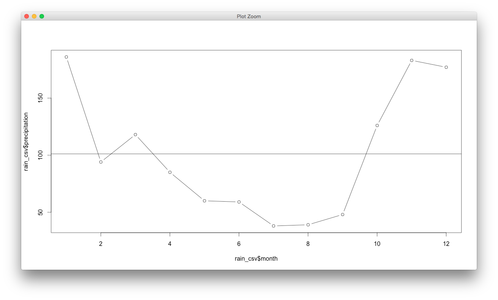

***

## R Packages (aka libraries)
R packages (aka libraries) may be one of the most useful things about R. Libraries are basically bundled up scripts that people (software developers, researchers, designers, artists, etc) have written to help take complicated tasks or computations, wrapped up in simple(r) to use functions to make programming easier, more fun, and easy to read. 

In this way, you can say that Processing is a language and also a "library" because it makes functions available (e.g. ellipse() and rect()) which would take 10 to 20 lines of code in Java and puts them into an easy to use function.

In R, we have countless numbers of libraries to help us to tasks. Remember earlier I mentioned that there are R packages that can help you do geoprocessing and even make your own interactive web map? Well, now we're going to introduce a package that allows us to **read in shapefile** into R so that we can use it as a basemap for our crime plot. 

**NOTE: It may seem like R libraries are just doing magic behind the scenes, but they are simply making more functions available to you to use that aren't already included in the base R library - think of it as an actually library, you go there to get books that you don't have at home ;)** 

SO to start, we need to **install** the package we want to use. After doing a few google serches, I found an R package called "GISTools" that allows us to read shapefiles into R, make chropleth maps, do geoprocessing, etc - essentially your own, free and open source GIS. 

### installing and adding a library
We install packages in R by using the *install.packages()* function:

	# ---------- Using our first R package to display a shapefile! ---------- #
	# install the maptools library
	install.packages("GISTools")
	install.packages('scales')

**NOTE**: If you get an error like "cannot write to lib" or something on windows -- you **need to change the read/write permissions** on that folder. You can do so by navigating to that folder > right click > properties > check the box that says "read/write".

After we install our R package, we need to import it to our script. We do so using the *library()* function:
	
	# import the gistools functions by calling the library() function
	library(GISTools)
	library(scales)

Now that we have our library imported, we have can read in some shapefiles that are conveniently sitting in our data folder. Similar to how we read in our .csv file, we just have to include the path name to each of our .geojson files.

	# --- read in shps --- #
	# Building shp
	fname_buildings ="https://raw.githubusercontent.com/joeyklee/aloha-r/master/data/example/buildings.geojson"
	buildings = readOGR(fname_buildings, 'OGRGeoJSON')
	plot(buildings) # plot to inspect
	
	# Roads shp
	fname_roads = "https://raw.githubusercontent.com/joeyklee/aloha-r/master/data/example/roads.geojson"
	roads = readOGR(fname_roads, 'OGRGeoJSON')
	plot(roads) # plot to inspect
	
	# Co2 points
	fname_co2 = "https://raw.githubusercontent.com/joeyklee/aloha-r/master/data/example/co2.geojson"
	co2 = readOGR(fname_co2, 'OGRGeoJSON')
	plot(paths)

By plotting the data, we can see what we have! Now, let's combine the plots together to make a very basic map:
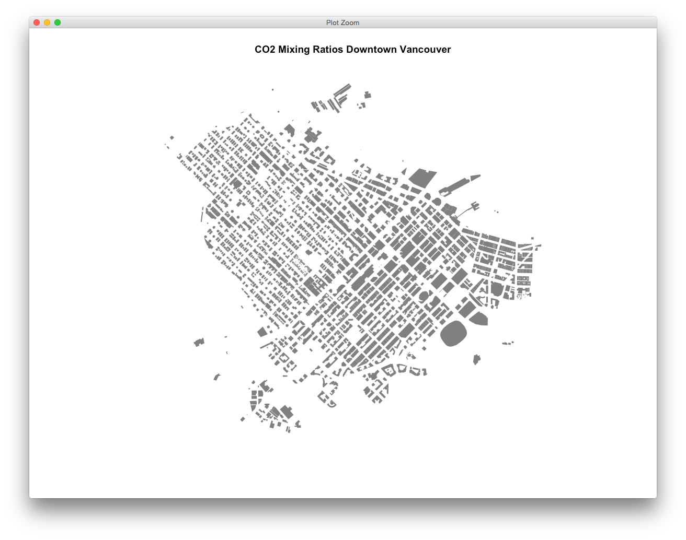

	# Plot the buildings
	plot(buildings, 
	     col = "#808080", 
	     border=F,
	     bg ="#FFFFFF",
	     main ="CO2 Mixing Ratios Downtown Vancouver")

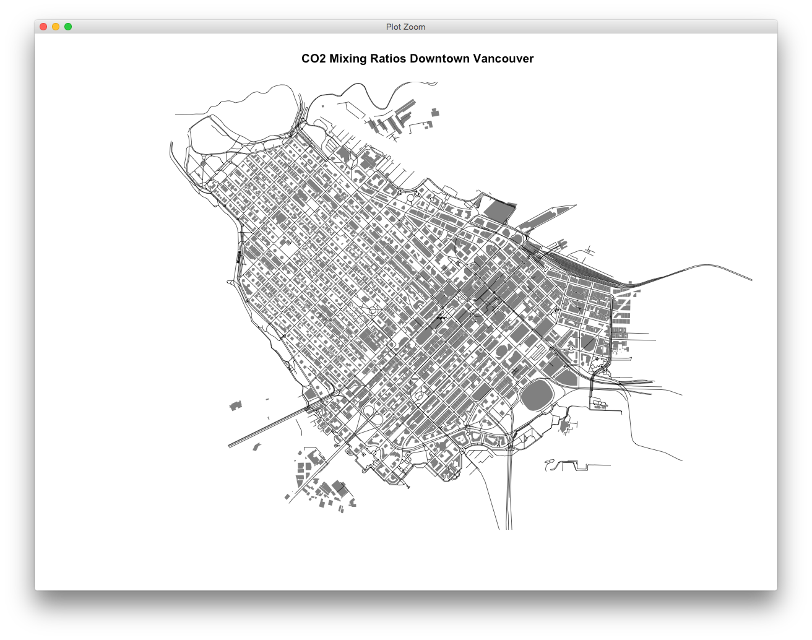

	# Add the roads to the plot with "add = TRUE"
	plot(roads,
	     col="#000000",
	     lwd=1,
	     add=TRUE)
	     

	
	# Add the Paths to the plot with "add = TRUE"
	vals = rescale(co2@data$co2, c(0.5, 5))
	plot(co2,
	     col="#FF6600",
	     pch= 20,
	     alpha=0.5,
	     cex=vals,
	     add=TRUE)

We can even add a north arrow in R (or later in Illustrator):

	# We can even add a north arrow:
	north.arrow(xb= -123.144035, yb=49.273001, len=0.0005)

And a scale bar:

	# scale bar:
	map.scale(xc= -123.151295, 49.271729, len=0.01, ndivs= 2,subdiv=3, units="test")

***Now you're more than primed to construct and deconstruct our first real-world R project!***

***
# Project: What are Vancouverites Complaining About?
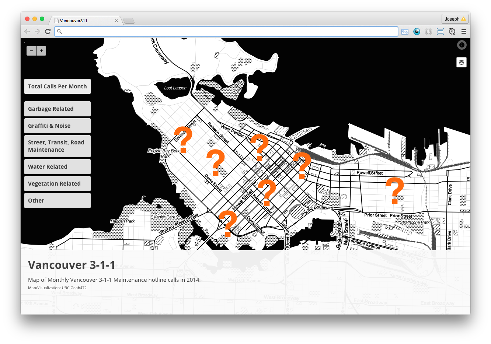

## Brief:
The City of Vancouver releases a dataset of the 3-1-1 phone calls - the general hotline regarding maintenance issues in the city. Currently there is no tool to visualize and access the data. How can citizens engage the city for these matters if there's no way to work with the data?  In the name of civic "hacking", the project brief is to develop a project that:

1. can parse and handle the BIG data being delivered by the city.
2. shows the 3-1-1 data and potentially highlights insights derived from the data in an accessible web application.

## Requirements:
As a data and design team, you must deliver:

1. a script written in an open source programming language that can parse, filter, and mine the 3-1-1 data - you will work with the 2014 data.
2. a web application that allows citizens of Vancouver to visualize the spatial and temporal aspects of the data as well as any insights derived from the data mining.
3. the code must be open and shared (e.g. Github)

## Timeline:
The timeline for the project is 3 weeks:

1. Week 1: Data Handling with R - acquire, parse, filter, & mine 3-1-1 data.
2. Week 2: Data Handling Continued / Interactive Web Mapping
3. Week 3: Interactive Web Mapping Project Synthesis

## Overview:
We will use this project to go through Ben Fry's Data Visualization Pipeline. 

This will be a collaborative project - you will need to communicate within and accross teams and be organized and have a well documented workflow. This will become clear when we generate the interactive map tile layers later on in the project.

***

## Process: Exploring the 3-1-1 data

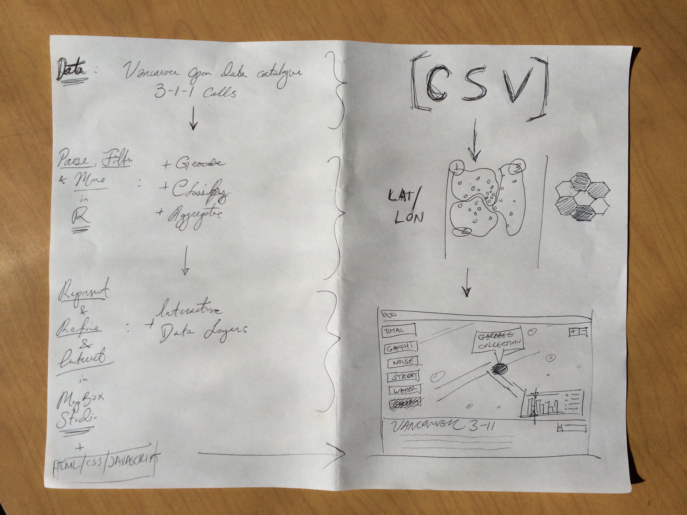

Data viz is hard and in the end comes down to a lot of experimentation and exploration. This script attempts to showcase how the data viz pipeline is done in practice and how it is far from a linear process, but rather a very interactive and dynamic process.

### setup:
Let's being our script by a nice cheeky commented header:

	######################################################
	# Vancouver 3-1-1: Data Processing Script
	# Date:
	# By: 
	# Desc: 
	######################################################
	
We noticed how libraries can help us to read in geographic data and even help us make new scales. Since this is a bigger project, we're going to need to help of some more libraries:

	# ------------------------------------------------- #
	# --------------- Install Libararies --------------- #
	# ------------------------------------------------- #
	install.packages("GISTools")
	install.packages('rgdal')
	install.packages('curl')
	install.packages("devtools")
	devtools::install_github("corynissen/geocodeHERE")
	
	# Unused Libraries:
	# install.packages("ggmap")
	# library(ggmap)

You will notice we have some unused libraries - these are some that I started out using in the beginning, but decided to not use. I kept them here just for future reference. NOTE: ggmap was previously used for it's **geocode()** function - but with google's 2500 api call limit, it wasn't enough for the 10,000+ geocoding events we would need for our project.

Let's load up our libraries now that we've installed them:

	# ------------------------------------------------- #
	# ---------------- Load Libararies ----------------- #
	# ------------------------------------------------- #
	library(GISTools)
	library(rgdal)
	library(geocodeHERE)
	library(curl)

### Acquire

We use the **curl()** function to make http/https requests from the web to get data and used our **read.csv()** function to read our table in to R.

	# ------------------------------------------------- #
	# ------------------- Acquire --------------------- #
	# ------------------------------------------------- #
	# access from the interwebz using "curl"
	fname = curl('https://raw.githubusercontent.com/joeyklee/aloha-r/master/data/calls_2014/201401CaseLocationsDetails.csv')
	# Read data as csv
	data = read.csv(fname, header=T)
	# inspect your data
	print(head(data))

### Parse

Upon inspecting our data, we notice we have the addresses, but the city has put int "#'s" to help with the anonymity of the callers. Furthermore, we notice that we don't have any lat/lon coordinates to work with to turn our 3-1-1 calls into a something spatial. How can we develop a solution for this?

First let's sub out the "#" with "0":

	# ------------------------------------------------- #
	# -------------- Parse: Geocoder ------------------- #
	# ------------------------------------------------- #
	# change intersection to 00's
	data$h_block = gsub("#", "0", data$Hundred_Block)
	print(head(data$h_block))

Next let's concatenate the newly created "h_block" column with the **Street_Name** column, and a string that specifices that all of the calls are from **Vancouver, BC, Cananda**:

	# Join the strings from each column together & add "Vancouver, BC":
	data$full_address = paste(data$h_block, 
	                          paste(data$Street_Name,
	                                "Vancouver, BC, Canada",
	                                sep=", "),
	                          sep=" ")

We also notice that the city has put in the word "intersection" for those calls that refer to an intersection. Let's take those out so as to make our geocoding parsing potentially easier:

	data$full_address = gsub("Intersection", "", data$full_address)
	print(data$full_address)

Now we will use Nokia's Here API for their geocoder - their limit on geocoding requests is ~10,000 calls per 24 hours. This works well since our data is ~10,000 features. This will take all of our addresses and return lat/lon coordinates for us to use. The total process takes about 20 min which is pretty fast - possibly faster with a good internet connection. 

	# Geocode the events - we use Nokia's Here API
	# Create an empty vector for lat and lon coordinates
	lat = c(); lon = c()
	# loop through the addresses
	for(i in 1: length(data$full_address)){
	  # store the address at index "i" as a character
	  address = as.character(data$full_address[i])
	  # append the latitude of the geocoded address to the lat vector
	  lat = c(lat,geocodeHERE_simple(address)$Latitude)
	  # append the longitude of the geocoded address to the lon vector
	  lon = c(lon,geocodeHERE_simple(address)$Longitude)
	  # at each iteration through the loop, print the coordinates - takes about 20 min.
	  print(paste("#",i,", ", lat[i], lon[i], sep=","))
	}
	
	# add the lat lon coordinates to the dataframe
	data$lat = lat
	data$lon = lon 
	
	# after geocoding, it's a good idea to write your file out!
	ofile ='insert filepath here' 
	write.csv(data, ofile)

### Mine

We won't be doing any heavy analysis on the data, but we will try to tease out some categories to make the data more intuitive for exploring. The first thing we'll do is to see what are the types of unique cases that are being called in:

	# ------------------------------------------------- #
	# --------------------- Mine ---------------------- #
	# ------------------------------------------------- #
	# --- Examine the unique cases --- #
	
	# examine how the cases are grouped - are these intuitive?
	unique(data$Department)
	unique(data$Division)
	
	# examine the types of cases - can we make new groups that are more useful?
	unique(data$Case_Type)
	# Print each unique case on a new line for easier inspection
	for (i in 1:length(unique(data$Case_Type))){
	  print(unique(data$Case_Type)[i], max.levels=0)
	}

We print out the cases and store them to a list here:

	Dead Animal Pickup Case
	Missed Garbage Pickup
	Abandoned Garbage Pickup - City Property & Parks
	PRB_Park Ranger SR
	Sign - Repair
	Animal Control General Inquiry Case
	Lost Pets Case
	Residential Parking Requests
	Missed Yard Trimmings and Food Scraps Pickup
	Traffic & Pedestrian Signal - New
	Graffiti Removal - City Property
	Poster/Sign Removal Request
	Street Furniture Repair and Maintenance Request
	Water Leaks/Breaks
	Street Cleaning & Debris Pickup
	Wheelchair Curb/Ramp Request
	Recycling Bag Request
	Animal Complaint - Non-Emergency Case
	Street Light - Out
	Missed Recycling Pickup
	Missed Apartment Recycling Pickup
	Street Tree Work Request SR
	Citizen Feedback
	Cart - Green (Yard Trimmings and Food Scraps)
	Water Service Turn On/Off Request
	Sewer Pipe Inquiries
	Fire Reinspection Request for Firehall
	Street Litter Can Request
	Electrical Inspection Cancellation Case
	Cart - Garbage
	Fire Reinspection Request for Inspector
	Collection Calendar Mail-Out Request
	PUI Noise Complaint Case
	Building Plans Information Request
	Licence Payment Request Case
	Streets - General Issues
	Street Light - Pole Repair
	Water Service Locate Request
	Recycling Box Request
	Gone Out of Business Case
	Street - Surface Water Flooding
	Blue Box and Leaf Removal Guide Mail-Out Request
	Illegal Dumping/Abandoned Garbage Pickup
	Sidewalk - Repair
	Abandoned Vehicle Request
	Cart - Apartment Recycling
	Water Work Site Complaint
	Parks Litter Can or Cart Request
	Water Hydrant Issue
	Secondary Suite Information Request
	Vegetation Maintenance SR
	Street - Repair
	Building Inspection Cancellation Case
	PUI Noise General Inquiry Case
	Snow Angel Program - Individual Volunteer
	Street Light - New/Relocation
	FPB_General Inquiry Case
	PUI General Inquiry Case
	Pothole - Repair
	Trees and Vegetation Encroachment - City Property
	Holding Stray Case
	Green Bin Program - Feedback and General Inquiry
	Traffic Calming Request
	Traffic & Pedestrian Signal - Modify
	Catch Basin Issues
	Snow & Ice Removal - City Property
	Plumbing and Gas Inspection Cancellation Case
	Street Light - Flat Glass Fixture Request
	General Information Request SR
	Traffic Sign - Modify
	Sewer Manhole Issues
	Snow and Ice Removal - Sidewalk Bylaw Violation
	Water General Inquiry
	Sewer General Inquiries
	Curbside Sign - New
	Occupancy Permit Information Request
	Graffiti Removal - External Organization
	Water General Work Request
	Pavement Marking - Repair
	Election General Concerns
	Home Safety Check Request Case
	Apartment Recycling - Registration Request
	Street and Traffic Light - Utility Damage
	Sewer Odour Complaints
	Horticulture Inquiry on Right-of-Way
	Traffic Sign - New
	Sewer Design General Inquiries
	Homelessness/Transient Issue
	Banner Request
	Sewer Separation Inspection Cancellation Case
	Boulevard Maintenance Issues
	Parking Meter Requests
	Bridges & Structures - Repair
	Street Sign - New
	Animal Cremation Case
	Dead Skunk Pickup
	Water Pressure or No Water Issue
	Water Conservation Violation
	Truck Violation
	Water Meter Issue
	Flag Request
	Pavement Markings Request - New/Modify
	Snow and Ice Removal - Sidewalk Bylaw Inquiry
	Curbside Sign - Modify
	Crosswalk Marking - New
	Chafer Beetle Feedback
	Water Damage To City Water System
	Traffic Count Request
	Sewer Utility Damage

Whoa! That's a heck of a lot of cases. Our role of data visualization people is to take this mess and try to make sense of it so that we can represent it in a manner that is more intuitive and possibly delightful. There are a bunch of ways that we can organize these cases into specific classes, so I invite you to think about how we might best organize these. For now, I've come up with **6 classes** that bin these cases together. **Does this make sense? Should we change it?**:

	// --- graffiti and noise --- //
	Graffiti Removal - City Property
	Graffiti Removal - External Organization
	PUI Noise Complaint Case
	PUI Noise General Inquiry Case
	
	// --- street surface & Maintenance --- //
	Street Furniture Repair and Maintenance Request
	Street Cleaning & Debris Pickup
	Street Light - Out
	Street Tree Work Request SR
	Street Litter Can Request
	Streets - General Issues
	Street Light - Pole Repair
	Street - Surface Water Flooding
	Street - Repair
	Street Light - New/Relocation
	Street Light - Flat Glass Fixture Request
	Street and Traffic Light - Utility Damage
	Street Sign - New
	Crosswalk Marking - New
	Boulevard Maintenance Issues
	Bicycle Route Map Request
	Sidewalk - Repair
	Pothole - Repair
	Pavement Markings Request - New/Modify
	Pavement Marking - Repair
	Sewer Pipe Inquiries
	Sewer Manhole Issues
	Sewer General Inquiries
	Sewer Design General Inquiries
	Sewer Separation Inspection Cancellation Case
	Sewer Utility Damage
	Sewer Odour Complaints
	Plumbing and Gas Inspection Cancellation Case
	Snow Angel Program - Individual Volunteer
	Snow & Ice Removal - City Property
	Snow and Ice Removal - Sidewalk Bylaw Violation
	Snow and Ice Removal - Sidewalk Bylaw Inquiry
	Traffic & Pedestrian Signal - New
	Traffic Calming Request
	Traffic & Pedestrian Signal - Modify
	Traffic Sign - Modify
	Street and Traffic Light - Utility Damage
	Traffic Sign - New
	Traffic Count Request
	Truck Violation
	Residential Parking Requests
	Parking Meter Requests
	Abandoned Vehicle Request
	
	// --- garbage, Recycling & organics --- //
	Missed Garbage Pickup
	Abandoned Garbage Pickup - City Property & Parks
	Cart - Garbage
	Illegal Dumping/Abandoned Garbage Pickup
	Parks Litter Can or Cart Request
	Recycling Bag Request
	Missed Recycling Pickup
	Missed Apartment Recycling Pickup
	Recycling Box Request
	Cart - Apartment Recycling
	Apartment Recycling - Registration Request
	Transfer Station & Recycling - General Inquiries
	Blue Box and Leaf Removal Guide Mail-Out Request
	Missed Yard Trimmings and Food Scraps Pickup
	Cart - Green (Yard Trimmings and Food Scraps)
	Green Bin Program - Feedback and General Inquiry
	Collection Calendar Mail-Out Request
	
	// --- Water Related Issues --- //
	Water Leaks/Breaks
	Water Service Turn On/Off Request
	Water Service Locate Request
	Street - Surface Water Flooding
	Water Work Site Complaint
	Water Hydrant Issue
	Water General Inquiry
	Water General Work Request
	Water Pressure or No Water Issue
	Water Conservation Violation
	Water Meter Issue
	Water Damage To City Water System
	Catch Basin Issues
	
	// --- animal and vegetation related --- //
	Dead Animal Pickup Case
	Animal Control General Inquiry Case
	Animal Complaint - Non-Emergency Case
	Animal Cremation Case
	Dead Skunk Pickup
	Lost Pets Case
	Holding Stray Case
	Chafer Beetle Feedback
	Vegetation Maintenance SR
	Trees and Vegetation Encroachment - City Property
	Horticulture Inquiry on Right-of-Way
	
	// --- Other --- //
	Poster/Sign Removal Request
	Sign - Repair
	Curbside Sign - New
	Curbside Sign - Modify
	Banner Request
	Fire Reinspection Request for Firehall
	Fire Reinspection Request for Inspector
	Citizen Feedback
	Wheelchair Curb/Ramp Request
	Wheelchair
	PRB_Park Ranger SR
	Building Plans Information Request
	Building Inspection Cancellation Case
	Licence Payment Request Case
	Gone Out of Business Case
	FPB_General Inquiry Case
	PUI General Inquiry Case
	Electrical Inspection Cancellation Case
	Bridges & Structures - Repair
	Secondary Suite Information Request
	General Information Request SR
	Election General Concerns
	Occupancy Permit Information Request
	Home Safety Check Request Case
	Flag Request
	Homelessness/Transient Issue

In the end our 6 classes are:

1. graffiti and noise
2. street surface & Maintenance
3. animal and vegetation related
4. water related
5. garbage, Recycling & organics related
6. other

Now that we have our classes, we can put them in arrays:

	# Determine classes to group case types:

	# graffiti and noise
	graffiti_noise = c('Graffiti Removal - City Property','Graffiti Removal - External Organization','PUI Noise Complaint Case','PUI Noise General Inquiry Case')
	
	# street surface & Maintenance
	street_traffic_maint = c('Street Furniture Repair and Maintenance Request','Street Cleaning & Debris Pickup','Street Light - Out','Street Tree Work Request SR','Street Litter Can Request','Streets - General Issues','Street Light - Pole Repair','Street - Surface Water Flooding','Street - Repair','Street Light - New/Relocation','Street Light - Flat Glass Fixture Request','Street and Traffic Light - Utility Damage','Street Sign - New','Crosswalk Marking - New','Boulevard Maintenance Issues','Bicycle Route Map Request','Sidewalk - Repair','Pothole - Repair','Pavement Markings Request - New/Modify','Pavement Marking - Repair','Sewer Pipe Inquiries','Sewer Manhole Issues','Sewer General Inquiries','Sewer Design General Inquiries','Sewer Separation Inspection Cancellation Case','Sewer Utility Damage','Sewer Odour Complaints','Plumbing and Gas Inspection Cancellation Case','Snow Angel Program - Individual Volunteer','Snow & Ice Removal - City Property','Snow and Ice Removal - Sidewalk Bylaw Violation','Snow and Ice Removal - Sidewalk Bylaw Inquiry','Traffic & Pedestrian Signal - New','Traffic Calming Request','Traffic & Pedestrian Signal - Modify','Traffic Sign - Modify','Street and Traffic Light - Utility Damage','Traffic Sign - New','Traffic Count Request','Truck Violation','Residential Parking Requests','Parking Meter Requests','Abandoned Vehicle Request')
	
	# garbage, Recycling & organics related
	garbage_recycling_organics = c('Missed Garbage Pickup','Abandoned Garbage Pickup - City Property & Parks','Cart - Garbage','Illegal Dumping/Abandoned Garbage Pickup','Parks Litter Can or Cart Request','Recycling Bag Request','Missed Recycling Pickup','Missed Apartment Recycling Pickup','Recycling Box Request','Cart - Apartment Recycling','Apartment Recycling - Registration Request','Transfer Station & Recycling - General Inquiries','Blue Box and Leaf Removal Guide Mail-Out Request','Missed Yard Trimmings and Food Scraps Pickup','Cart - Green (Yard Trimmings and Food Scraps)','Green Bin Program - Feedback and General Inquiry','Collection Calendar Mail-Out Request')
	
	# water related
	water = c('Water Leaks/Breaks','Water Service Turn On/Off Request','Water Service Locate Request','Street - Surface Water Flooding','Water Work Site Complaint','Water Hydrant Issue','Water General Inquiry','Water General Work Request','Water Pressure or No Water Issue','Water Conservation Violation','Water Meter Issue','Water Damage To City Water System','Catch Basin Issues')
	
	#animal and vegetation related
	animal_vegetation = c('Dead Animal Pickup Case','Animal Control General Inquiry Case','Animal Complaint - Non-Emergency Case','Animal Cremation Case','Dead Skunk Pickup','Lost Pets Case','Holding Stray Case','Chafer Beetle Feedback','Vegetation Maintenance SR','Trees and Vegetation Encroachment - City Property','Horticulture Inquiry on Right-of-Way')
	
	# other
	other = c('Poster/Sign Removal Request','Sign - Repair','Curbside Sign - New','Curbside Sign - Modify','Banner Request','Fire Reinspection Request for Firehall','Fire Reinspection Request for Inspector','Citizen Feedback','Wheelchair Curb/Ramp Request','Wheelchair','PRB_Park Ranger SR','Building Plans Information Request','Building Inspection Cancellation Case','Licence Payment Request Case','Gone Out of Business Case','FPB_General Inquiry Case','PUI General Inquiry Case','Electrical Inspection Cancellation Case','Bridges & Structures - Repair','Secondary Suite Information Request','General Information Request SR','Election General Concerns','Occupancy Permit Information Request','Home Safety Check Request Case','Flag Request','Homelessness/Transient Issue')

We can then run through the lists and give each of the classes and **cid** so that it is easier to identify and represent them later:

	# give class id numbers:
	data$cid = 9999
	for(i in 1:length(data$Case_Type)){
	  if(data$Case_Type[i] %in% graffiti_noise){
	    data$cid[i] = 1    
	  }else if(data$Case_Type[i] %in% street_traffic_maint){
	    data$cid[i] = 2   
	  }else if(data$Case_Type[i] %in% garbage_recycling_organics){
	    data$cid[i] = 3   
	  }else if(data$Case_Type[i] %in% water){
	    data$cid[i] = 4   
	  }else if(data$Case_Type[i] %in% animal_vegetation){
	    data$cid[i] = 5   
	  }else{
	    data$cid[i] = 0   
	  }
	}
	
Great, so we now have our data binned into specific groups in a way that seems to make sense. However, if do a little poking around at our data, we notice that since our addresses are aggregated a lot of times to the same address point, our lat/lon coordinates come out the same. How can we deal with this spatial overlap? 

One way to do this is to add in some "jitter" to each point if it happens to have the same coordinates. 

	# --- handle overlapping points --- #
	# Set offset for points in same location:
	data$lat_offset = data$lat
	data$lon_offset = data$lon
	# Run loop - if value overlaps, offset it by a random number
	for(i in 1:length(data$lat)){
	  if ( (data$lat_offset[i] %in% data$lat_offset) && (data$lon_offset[i] %in% data$lon_offset)){
	    data$lat_offset[i] = data$lat_offset[i] + runif(1, 0.0001, 0.0005)
	    data$lon_offset[i] = data$lon_offset[i] + runif(1, 0.0001, 0.0005)
	  } 
	}

To derive some more insight into the data, how about looking at the top calls:

	# --- what are the top calls? --- #
	# get a frequency distribution of the calls:
	top_calls = data.frame(table(data$Case_Type))
	top_calls = top_calls[order(top_calls$Freq),]
	print(top_calls)
	

### Filter

So we've added in some new coordinates and fiddled with them a bit to help with the representation. At this point, it is a good idea to filter out any extraneous points or points that fall outside of our area of interest - in this case Vancouver. Geocoders aren't perfect and so we should be wary to include any false positives.

First we set a folder where our shapefiles currently are living and where they will go:

	# ------------------------------------------------- #
	# -------------------- Filter --------------------- #
	# ------------------------------------------------- #
	# set an output folder for our geojson files
	shpfolder = 'insert folder path here'

Let's subset out data that is either an NA or falls outside of Vancouver's bounds:
	
	# Subset only the data if the coordinates are within our bounds or if it is not a NA
	data_filter = subset(data, (lat <= 49.313162) & (lat >= 49.199554) & 
                       (lon <= -123.019028) & (lon >= -123.271371) & is.na(lon) == FALSE )
    
    # plot the data
    plot(data_filter$lon, data_filter$lat)
	
With a filtered dataset, we can now write our file out to a shapefile to use later (in Mapbox studio)
          
	# --- Convert Data to Shapefile --- #
	# store coordinates in dataframe
	coords_311 = data.frame(data_filter$lon_offset, data_filter$lat_offset)
	
	# create spatialPointsDataFrame
	data_shp = SpatialPointsDataFrame(coords = coords_311, data = data_filter)
	
	# set the projection to wgs84
	projection_wgs84 = CRS("+proj=longlat +datum=WGS84")
	proj4string(data_shp) = projection_wgs84
	
	# write the file to a shp
	# writeOGR(data_shp, 
	#          shpfolder,
	#          paste('calls_',yymm, sep=""),  driver="ESRI Shapefile")
	
	# write out the file to a geojson file
	writeOGR(data_shp, paste(shpfolder,'calls_','1401.geojson', sep=""),layer='data_shp',  driver='GeoJSON')

We have all the raw data, but remember that saying "overview first, details on demand"? Our brains simply can't understand the sheer number of points on the map. How about using some way of aggregating the points to a grid? Turns our hexagonal grids are quite good for conveying density of data points. I've created a hexagonal grid in QGIS at a resolution of about 250m x 280m:

First let's read in the grid and reproject it from utm zone 10 north to wgs84:

	# --- aggregate to a grid --- #
	# ref: http://www.inside-r.org/packages/cran/GISTools/docs/poly.counts
	# set the file name - combine the shpfolder with the name of the grid
	# grid_fn = paste(shpfolder,'hgrid_100m.shp', sep="")
	grid_fn = 'https://raw.githubusercontent.com/joeyklee/aloha-r/master/data/calls_2014/shp/hgrid_250m.geojson'
	# define the utm 10n projection
	# projection_utm10n = CRS('+proj=utm +zone=10 +ellps=GRS80 +towgs84=0,0,0,0,0,0,0 +units=m +no_defs')
	# read in the hex grid setting the projection to utm10n
	# hexgrid = readShapeSpatial(grid_fn, proj4string = projection_utm10n )
	hexgrid = readOGR(grid_fn, 'OGRGeoJSON')
	# transform the projection to wgs84 to match the point file and store it to a new variable
	hexgrid_wgs84 = spTransform(hexgrid, projection_wgs84)

Next, let's use the **poly.counts()** function to count the number of points in each grid cell:

	# Use the poly.counts() function to count the number of occurences of calls per grid cell
	grid_cnt = poly.counts(data_shp, hexgrid_wgs84)
	# create a data frame of the counts
	grid_total_counts = data.frame(grid_cnt)
	# set grid_total_counts dataframe to the hexgrid data
	hexgrid_wgs84$data = grid_total_counts$grid_cnt
	# remove all the grids without any calls
	hexgrid_wgs84 = subset(hexgrid_wgs84, grid_cnt >0)
	
Finally, write out the data to a shpfile to use later in Mapbox studio.

	# write the grid counts to a shp
	# writeOGR(hexgrid_wgs84, 
	#         shpfolder,
	#         'hgrid_250m-1401-counts',  driver="ESRI Shapefile")
	
	writeOGR(hexgrid_wgs84,
	paste(shpfolder,'hgrid_250m_','1401','_counts.geojson', sep=""),layer='hexgrid_wgs84',  driver='GeoJSON')

Theoretically, we have enough data now to start putting together our web app which visualizes the 3-1-1 data. The next step will be to work with the representation and using the data we produced to filter the visuals with user interactions. 

### Full script (adapted):

I've made some changes to the script to make it easier to iterate over the data for each month. Notice the section: "set file vars"

	######################################################
	# Vancouver 3-1-1: Data Processing Script
	# Date:
	# By: 
	# Desc: 
	######################################################
	
	# ------------------------------------------------- #
	# --------------- Install Libararies --------------- #
	# ------------------------------------------------- #
	install.packages("GISTools")
	install.packages('rgdal')
	install.packages('curl')
	install.packages("devtools")
	devtools::install_github("corynissen/geocodeHERE")
	
	# Unused Libraries:
	# install.packages("ggmap")
	# library(ggmap)
	
	# ------------------------------------------------- #
	# ---------------- Load Libararies ----------------- #
	# ------------------------------------------------- #
	library(GISTools)
	library(rgdal)
	library(geocodeHERE)
	library(curl)
	
	# ------------------------------------------------- #
	# ---------------- Set File Vars ------------------ #
	# ------------------------------------------------- #
	# access from the interwebz using "curl"
	fname = curl('https://raw.githubusercontent.com/joeyklee/aloha-r/master/data/calls_2014/201401CaseLocationsDetails.csv')
	ofile ='/Users/Jozo/Projects/Github-local/Workshop/aloha-r/data/calls_2014/201401CaseLocationsDetails-geo.csv' 
	yymm = 1401
	
	# ------------------------------------------------- #
	# ------------------- Acquire --------------------- #
	# ------------------------------------------------- #
	# # access from the interwebz using "curl"
	# fname = curl('https://raw.githubusercontent.com/joeyklee/aloha-r/master/data/calls_2014/201401CaseLocationsDetails.csv')
	# Read data as csv
	data = read.csv(fname, header=T)
	# inspect your data
	print(head(data))
	
	# ------------------------------------------------- #
	# -------------- Parse: Geocoder ------------------- #
	# ------------------------------------------------- #
	# change intersection to 00's
	data$h_block = gsub("#", "0", data$Hundred_Block)
	print(head(data$h_block))
	
	# Join the strings from each column together & add "Vancouver, BC":
	data$full_address = paste(data$h_block, 
	                          paste(data$Street_Name,
	                                "Vancouver, BC, Canada",
	                                sep=", "),
	                          sep=" ")
	data$full_address = gsub("Intersection", "", data$full_address)
	print(data$full_address)
	
	# Geocode the events - we use Nokia's Here API
	# Create an empty vector for lat and lon coordinates
	lat = c(); lon = c()
	# loop through the addresses
	for(i in 1: length(data$full_address)){
	  # store the address at index "i" as a character
	  address = as.character(data$full_address[i])
	  # append the latitude of the geocoded address to the lat vector
	  lat = c(lat,geocodeHERE_simple(address)$Latitude)
	  # append the longitude of the geocoded address to the lon vector
	  lon = c(lon,geocodeHERE_simple(address)$Longitude)
	  # at each iteration through the loop, print the coordinates - takes about 20 min.
	  print(paste(i, lat[i], lon[i], sep=","))
	}
	
	# add the lat lon coordinates to the dataframe
	data$lat = lat
	data$lon = lon
	
	# after geocoding, it's a good idea to write your file out!
	# ofile ='/Users/Jozo/Projects/Github-local/Workshop/aloha-r/data/CaseLocationsDetails_2014_CSV/201401CaseLocationsDetails-geo.csv' 
	write.csv(data, ofile)
	
	# ------------------------------------------------- #
	# --------------------- Mine ---------------------- #
	# ------------------------------------------------- #
	# --- Examine the unique cases --- #
	
	# examine how the cases are grouped - are these intuitive?
	unique(data$Department)
	unique(data$Division)
	
	# examine the types of cases - can we make new groups that are more useful?
	unique(data$Case_Type)
	# Print each unique case on a new line for easier inspection
	for (i in 1:length(unique(data$Case_Type))){
	  print(unique(data$Case_Type)[i], max.levels=0)
	}
	
	# Determine classes to group case types:
	graffiti_noise = c('Graffiti Removal - City Property','Graffiti Removal - External Organization','PUI Noise Complaint Case','PUI Noise General Inquiry Case')
	street_traffic_maint = c('Street Furniture Repair and Maintenance Request','Street Cleaning & Debris Pickup','Street Light - Out','Street Tree Work Request SR','Street Litter Can Request','Streets - General Issues','Street Light - Pole Repair','Street - Surface Water Flooding','Street - Repair','Street Light - New/Relocation','Street Light - Flat Glass Fixture Request','Street and Traffic Light - Utility Damage','Street Sign - New','Crosswalk Marking - New','Boulevard Maintenance Issues','Bicycle Route Map Request','Sidewalk - Repair','Pothole - Repair','Pavement Markings Request - New/Modify','Pavement Marking - Repair','Sewer Pipe Inquiries','Sewer Manhole Issues','Sewer General Inquiries','Sewer Design General Inquiries','Sewer Separation Inspection Cancellation Case','Sewer Utility Damage','Sewer Odour Complaints','Plumbing and Gas Inspection Cancellation Case','Snow Angel Program - Individual Volunteer','Snow & Ice Removal - City Property','Snow and Ice Removal - Sidewalk Bylaw Violation','Snow and Ice Removal - Sidewalk Bylaw Inquiry','Traffic & Pedestrian Signal - New','Traffic Calming Request','Traffic & Pedestrian Signal - Modify','Traffic Sign - Modify','Street and Traffic Light - Utility Damage','Traffic Sign - New','Traffic Count Request','Truck Violation','Residential Parking Requests','Parking Meter Requests','Abandoned Vehicle Request')
	garbage_recycling_organics = c('Missed Garbage Pickup','Abandoned Garbage Pickup - City Property & Parks','Cart - Garbage','Illegal Dumping/Abandoned Garbage Pickup','Parks Litter Can or Cart Request','Recycling Bag Request','Missed Recycling Pickup','Missed Apartment Recycling Pickup','Recycling Box Request','Cart - Apartment Recycling','Apartment Recycling - Registration Request','Transfer Station & Recycling - General Inquiries','Blue Box and Leaf Removal Guide Mail-Out Request','Missed Yard Trimmings and Food Scraps Pickup','Cart - Green (Yard Trimmings and Food Scraps)','Green Bin Program - Feedback and General Inquiry','Collection Calendar Mail-Out Request')
	water = c('Water Leaks/Breaks','Water Service Turn On/Off Request','Water Service Locate Request','Street - Surface Water Flooding','Water Work Site Complaint','Water Hydrant Issue','Water General Inquiry','Water General Work Request','Water Pressure or No Water Issue','Water Conservation Violation','Water Meter Issue','Water Damage To City Water System','Catch Basin Issues')
	animal_vegetation = c('Dead Animal Pickup Case','Animal Control General Inquiry Case','Animal Complaint - Non-Emergency Case','Animal Cremation Case','Dead Skunk Pickup','Lost Pets Case','Holding Stray Case','Chafer Beetle Feedback','Vegetation Maintenance SR','Trees and Vegetation Encroachment - City Property','Horticulture Inquiry on Right-of-Way')
	other = c('Poster/Sign Removal Request','Sign - Repair','Curbside Sign - New','Curbside Sign - Modify','Banner Request','Fire Reinspection Request for Firehall','Fire Reinspection Request for Inspector','Citizen Feedback','Wheelchair Curb/Ramp Request','Wheelchair','PRB_Park Ranger SR','Building Plans Information Request','Building Inspection Cancellation Case','Licence Payment Request Case','Gone Out of Business Case','FPB_General Inquiry Case','PUI General Inquiry Case','Electrical Inspection Cancellation Case','Bridges & Structures - Repair','Secondary Suite Information Request','General Information Request SR','Election General Concerns','Occupancy Permit Information Request','Home Safety Check Request Case','Flag Request','Homelessness/Transient Issue')
	
	# give class id numbers:
	data$cid = 9999
	for(i in 1:length(data$Case_Type)){
	  if(data$Case_Type[i] %in% graffiti_noise){
	    data$cid[i] = 1    
	  }else if(data$Case_Type[i] %in% street_traffic_maint){
	    data$cid[i] = 2   
	  }else if(data$Case_Type[i] %in% garbage_recycling_organics){
	    data$cid[i] = 3   
	  }else if(data$Case_Type[i] %in% water){
	    data$cid[i] = 4   
	  }else if(data$Case_Type[i] %in% animal_vegetation){
	    data$cid[i] = 5   
	  }else{
	    data$cid[i] = 0   
	  }
	}
	
	# --- handle overlapping points --- #
	# Set offset for points in same location:
	data$lat_offset = data$lat
	data$lon_offset = data$lon
	# Run loop - if value overlaps, offset it by a random number
	for(i in 1:length(data$lat)){
	  if ( (data$lat_offset[i] %in% data$lat_offset) && (data$lon_offset[i] %in% data$lon_offset)){
	    data$lat_offset[i] = data$lat_offset[i] + runif(1, 0.0001, 0.0005)
	    data$lon_offset[i] = data$lon_offset[i] + runif(1, 0.0001, 0.0005)
	  } 
	}
	
	# --- what are the top calls? --- #
	# get a frequency distribution of the calls:
	top_calls = data.frame(table(data$Case_Type))
	top_calls = top_calls[order(top_calls$Freq),]
	print(top_calls)
	
	
	# ------------------------------------------------- #
	# -------------------- Filter --------------------- #
	# ------------------------------------------------- #
	# set an output folder for our geojson files
	shpfolder = '/Users/Jozo/Projects/Github-local/Workshop/aloha-r/data/calls_2014/shp/'
	
	# Subset only the data if the coordinates are within our bounds or if it is not a NA
	data_filter = subset(data, (lat <= 49.313162) & (lat >= 49.199554) & 
	                       (lon <= -123.019028) & (lon >= -123.271371) & is.na(lon) == FALSE )
	plot(data_filter$lon, data_filter$lat)
	
	# --- Convert Data to Shapefile --- #
	# store coordinates in dataframe
	coords_311 = data.frame(data_filter$lon_offset, data_filter$lat_offset)
	# create spatialPointsDataFrame
	data_shp = SpatialPointsDataFrame(coords = coords_311, data = data_filter)
	# set the projection to wgs84
	projection_wgs84 = CRS("+proj=longlat +datum=WGS84")
	proj4string(data_shp) = projection_wgs84
	# write the file to a shp
	# writeOGR(data_shp, 
	#          shpfolder,
	#          paste('calls_',yymm, sep=""),  driver="ESRI Shapefile")
	writeOGR(data_shp, paste(shpfolder,'calls_',yymm, sep=""),layer='data_shp',  driver='GeoJSON')
	
	# --- aggregate to a grid --- #
	# ref: http://www.inside-r.org/packages/cran/GISTools/docs/poly.counts
	# set the file name - combine the shpfolder with the name of the grid
	# grid_fn = paste(shpfolder,'hgrid_100m.shp', sep="")
	grid_fn = 'https://raw.githubusercontent.com/joeyklee/aloha-r/master/data/calls_2014/shp/hgrid_250m.geojson'
	# define the utm 10n projection
	# projection_utm10n = CRS('+proj=utm +zone=10 +ellps=GRS80 +towgs84=0,0,0,0,0,0,0 +units=m +no_defs')
	# read in the hex grid setting the projection to utm10n
	# hexgrid = readShapeSpatial(grid_fn, proj4string = projection_utm10n )
	hexgrid = readOGR(grid_fn, 'OGRGeoJSON')
	# transform the projection to wgs84 to match the point file and store it to a new variable
	hexgrid_wgs84 = spTransform(hexgrid, projection_wgs84)
	
	# Use the poly.counts() function to count the number of occurences of calls per grid cell
	grid_cnt = poly.counts(data_shp, hexgrid_wgs84)
	# create a data frame of the counts
	grid_total_counts = data.frame(grid_cnt)
	# set grid_total_counts dataframe to the hexgrid data
	hexgrid_wgs84$data = grid_total_counts$grid_cnt
	# remove all the grids without any calls
	hexgrid_wgs84 = subset(hexgrid_wgs84, grid_cnt >0)
	
	# write the grid counts to a shp
	# writeOGR(hexgrid_wgs84, 
	#          shpfolder,
	#          paste('hgrid_100m-',yymm,'-counts', sep=""),  driver="ESRI Shapefile")
	
	writeOGR(hexgrid_wgs84, paste(shpfolder,
	                              'hgrid_250m_',
	                              yymm,
	                              '_counts', sep=""),
	         layer='hexgrid_wgs84',  driver='GeoJSON')
	
	

	
	

***
# Creating the Full Dataset
***
## Loop

We completed the exploration for 1 month, but what about the remaining 11 months? What is the value added of having the other temporal data?

Let's run the script on the remaining other data for the other months. We have to change a few of our parameters each time:

1. the link to the data
2. the output csv file we write after the geocoding
3. the shpfile we output after the "jitter"
4. the shapefile of the total calls

It doesn't make sense for **all** of us to run this script for each month. Can we be coordinated enough to break up the task in smaller groups? How do we share the data afterward? What is a good naming convention for each of the files? These are all decisions we will have to make! 

***
# Your own web map with R Leaflet
***
## Overview
We've just created a whole bunch of data and so far it is just a bunch of shapefiles (or geojson files - depending on what you exported) and .csv files. We haven't even had the chance to look at what we've made! While there are a dozen tools we could use to visualize and interact with our data (e.g. Tilemill, Mapbox Studio, CartoDB, Tableau, etc), we are going to stick with R for now and let it "gently" introduce us to the **fundamentals of a web map**.  

## Web Map Fundamentals
A number of great people out there have created an overview of web map fundamentals, let's take a look and learn how it all works:

[Alan McConchie & Beth Schechter! - anatomy of a web map](http://maptime.io/anatomy-of-a-web-map/)

[Maptime ATX - web map fundamentals](http://maptimeatx.github.io/web-mapping-fundamentals/#1)

[Joey's Hello Web Maps Intro](http://joeyklee.github.io/hellowebmaps/#/)

## Enter: R Leaflet
So if we know that to make a web map generally is composed of:

1. map tiles (most of the time)
	
	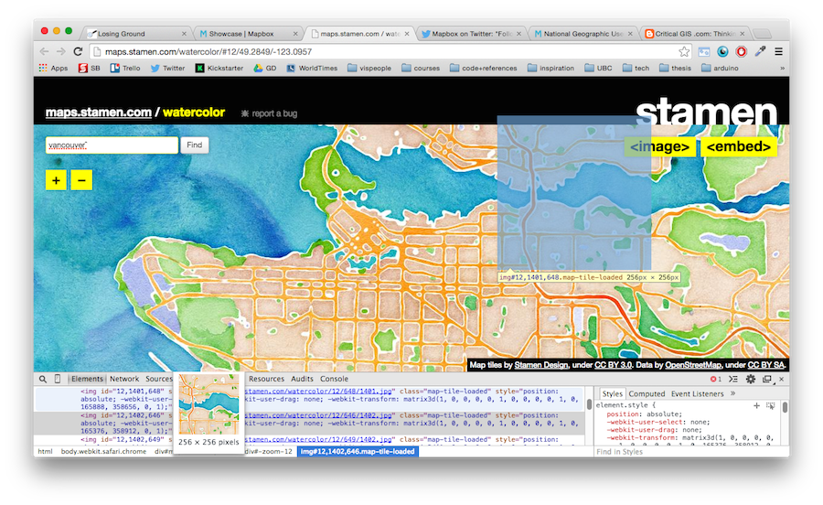

2. geodata

	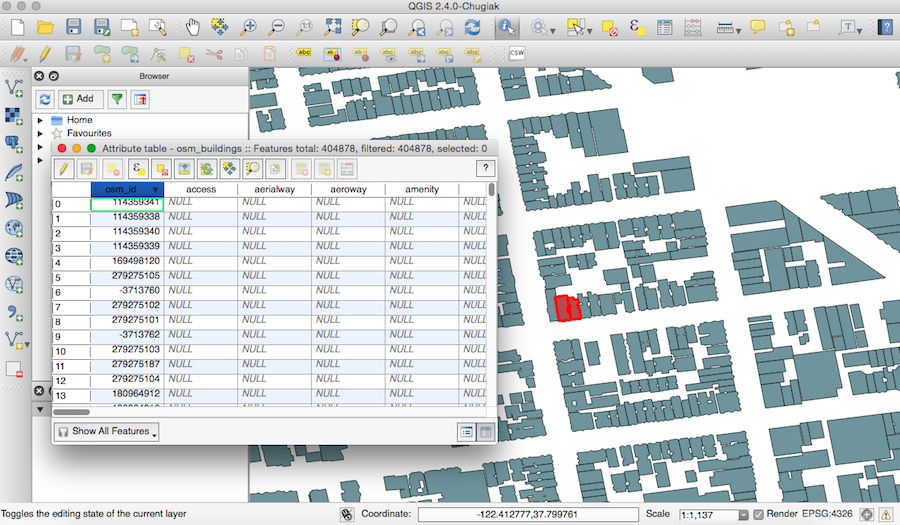
 
3. html/css/javascript (your webstack)

	

And we also know that:

1. we know **little or nothing** about html/css/javascript
2. we haven't made any map tiles

**THEN HOW THE HELL ARE WE SUPPOSED TO MAKE OUR OWN WEB MAP???**

Well, turns out that others have also been in your same predicament and have developed a library to bring web mapping to R programmers. 

**Wait a second... so we can make a web map, without coding any html, css, or javascript?**

YES! sort of. Some clever people got together and wrote a library in R that takes a very famous and awesome javascript library (yes there are libraries in javascript, and every other language out there!) called "Leaflet.js" and allows you to write R code and export a fully functional web map, with tiles and geodata drawn right on top! 

Basically what happens is:

1. you load up the "leaflet" library for R
2. you write R code that then gets **translated** into html/css/javascript
3. your translated code is written into an ".html" file which includes:
	* your html skeleton
	* the leaflet.js library and leaflet css style
	* your javascript which was translated from your R code 

***
### Our First Example

**With 5 lines of code, we're going to make our first interactive web map!**

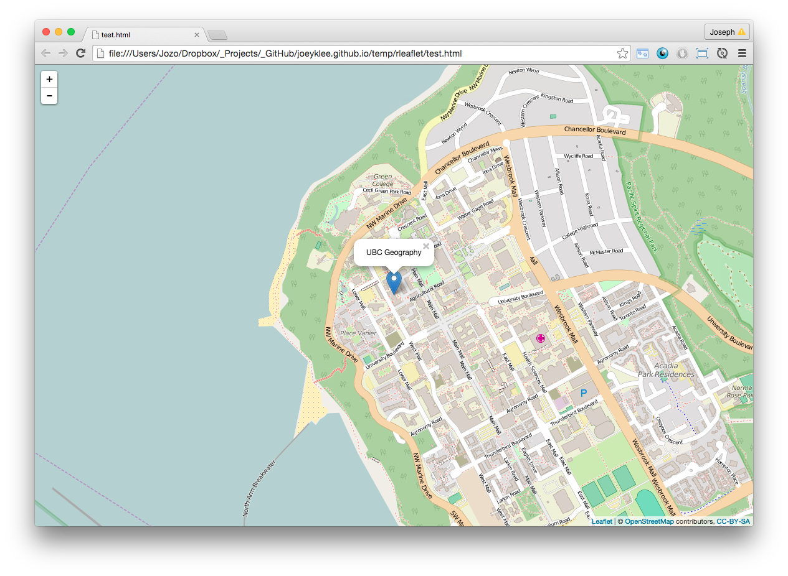

Run these lines of code and create your first interactive map with R!

	# install the leaflet library
	devtools::install_github("rstudio/leaflet")
	
	# add the leaflet library to your script
	library(leaflet)
	
	# initiate the leaflet instance and store it to a variable
	m <- leaflet()
	
	# we want to add map tiles so we use the addTiles() function - the default is openstreetmap
	m <- addTiles(m)
	
	# we can add markers by using the addMarkers() function
	m <- addMarkers(m, lng=-123.256168, lat=49.266063, popup="T")
	
	# we can "run"/compile the map, by running the printing it
	print(m)

Now if we **export** the map and **save as webpage...**:

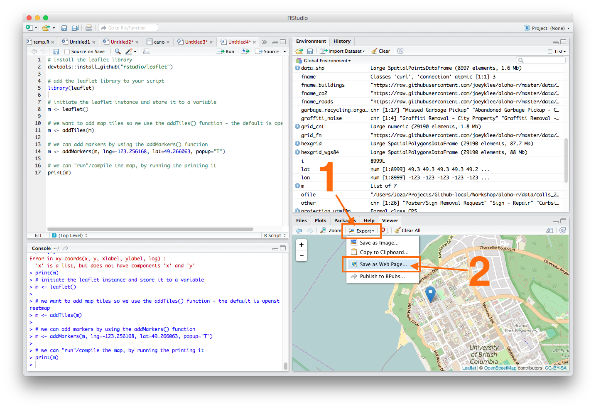

The convention for naming .html files is "index", therefore, let's name our file: **index.html**

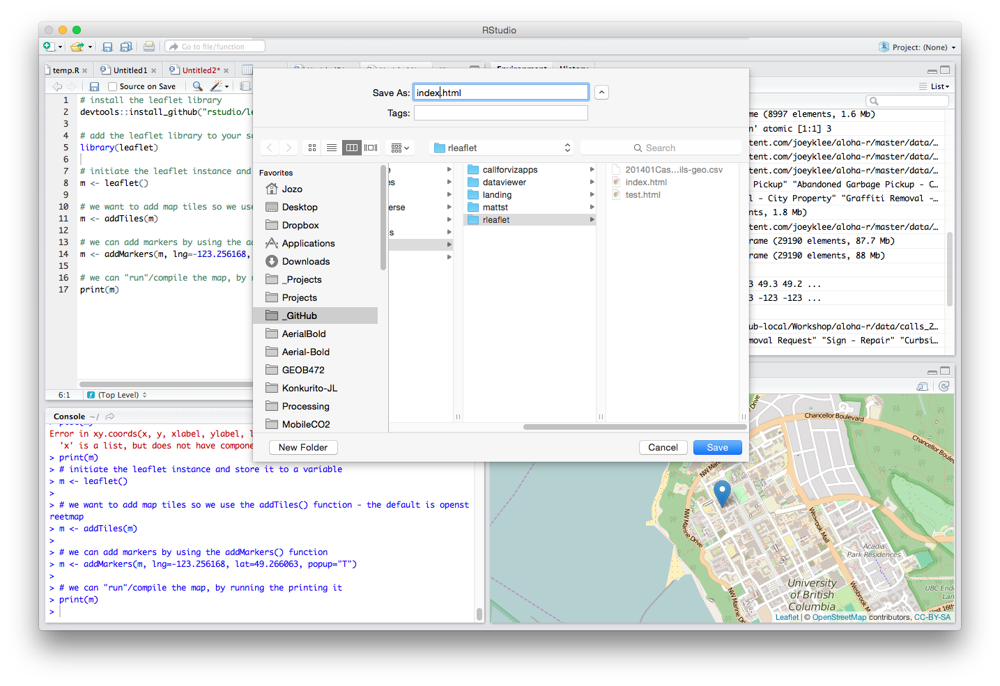

If you were to inspect your web map now, you would see basically:
	
	<!DOCTYPE html>
	<html>
		<head>
		    <meta charset="utf-8" />
		    
		    
		    <link href="some css related to leaflet" />
		    
		    <link href="some javascript related to leaflet" rel="stylesheet" />
		    <link href="some css related to leaflet" rel="stylesheet" />
		    
		    
		</head>
	
		<body style="background-color:white;">
		    

		        

		    

		    
		    
		</body>
	
	</html>

**Don't worry if this doesn't make any sense! Just know that what you wrote in R, turned into all of these other bits of code!**

***
# Working with our 3-1-1 Data
***
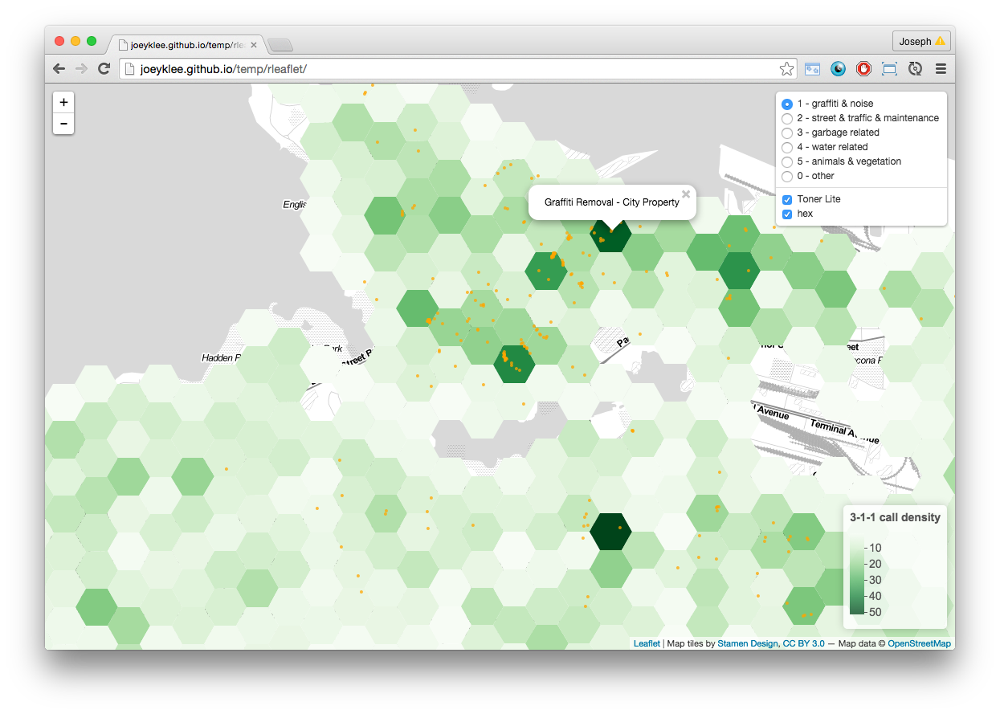

So let's shift gears and work with our 3-1-1 data. We now we have a bunch of points for the month of January and hexagonal grids with the call densities. How do we begin to interact with the data?

**What are the main interactions we are going to work with?**:

1. pop-up details (aka tool tips) on mouse click
	* reveal specific case type
	* reveal counts 
2. toggle layers on and off

** Let's get started with a rather verbose first example**

## Version 1: Working with Point Data

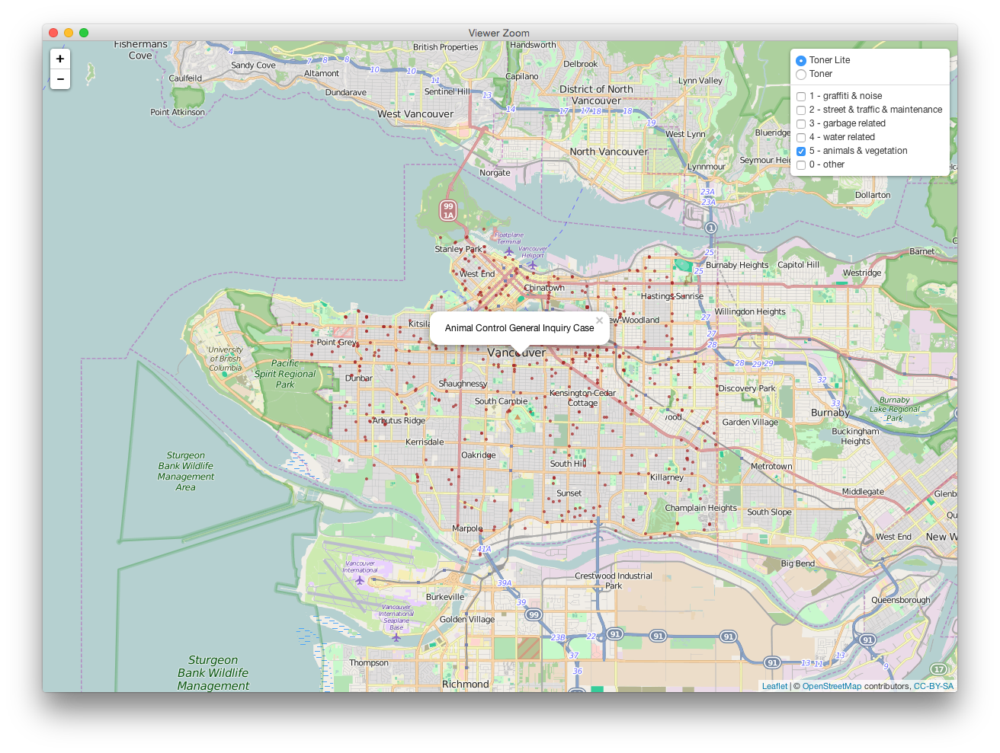
If you're continuing from the 3-1-1 data example, we should have a dataframe called **data_filter** (if you don't, then you can read in your data after geocoding step). We're going to use the **subset()** function to get store our data into separate variables.

	# subset out your data_filter:
	df_graffiti_noise = subset(data_filter, cid == 1)
	df_street_traffic_maint = subset(data_filter, cid == 2)
	df_garbage_recycling_organics = subset(data_filter, cid == 3)
	df_water = subset(data_filter, cid == 4)
	df_animal_vegetation = subset(data_filter, cid == 5)
	df_other = subset(data_filter, cid == 0)

Great, now each of our data categories lives in its own variable name.

Now we're going to initiate our leaflet map:
	
	# initiate leaflet
	m = leaflet()
	
	# add openstreetmap tiles (default)
	m = addTiles(m)

Now we are going to define some colors using leaflet's special **colorFactor()** function:

	colorFactors = colorFactor(c('red', 'orange', 'purple', 'blue', 'pink', 'brown'), domain=data_filter$cid)

 
What the colorFactor function does is take our list of colors and "maps" then to the domain that we defined. For example, when we apply the colorFactor() function to our data, it will color a point "red", if the "cid" in the data is equal to "0", "orange" if the "cid" is equal to 1, etc.

The next step is to add our points to the map. We can do so using the **addCircleMarkers()** function: 

	m = addCircleMarkers(
						  m, 
	                      lng=df_graffiti_noise$lon_offset, # we feed the longitude coordinates 
	                      lat=df_graffiti_noise$lat_offset, 	                      popup=df_graffiti_noise$Case_Type, 
	                      radius=2, 
	                      stroke = FALSE, 
	                      fillOpacity = 0.75, 
	                      color = colorFactors(df_graffiti_noise$cid),
	                      group = "1 - graffiti & noise"
	                    )

Here's what each argument is saying:

* **lng**: we add our markers to our m
* **lat**:we feed the latitude coordinates 
* **popup**:each feature will show the Case_Type on click
* **radius**: we set the circle radius size
* **stroke**: we set stroke to false
* **fillOpacity**: we set a fill opacity
* **color**: the colorFactors() function is applying the color based on the value of the "cid"
* **group**:we name the group

<!---->

Now repeat this function across the other layers:

	                     
	m = addCircleMarkers(m, 
                      lng=df_street_traffic_maint$lon_offset, lat=df_street_traffic_maint$lat_offset, 
                      popup=df_street_traffic_maint$Case_Type, 
                      radius=2, 
                      stroke = FALSE, fillOpacity = 0.75,
                      color = colorFactors(df_street_traffic_maint$cid),
                      group = "2 - street & traffic & maintenance")
	m = addCircleMarkers(m, 
	                      lng=df_garbage_recycling_organics$lon_offset, lat=df_garbage_recycling_organics$lat_offset, 
	                      popup=df_garbage_recycling_organics$Case_Type, 
	                      radius=2, 
	                      stroke = FALSE, fillOpacity = 0.75,
	                      color = colorFactors(df_garbage_recycling_organics$cid),
	                      group = "3 - garbage related")
	m = addCircleMarkers(m, 
	                      lng=df_water$lon_offset, lat=df_water$lat_offset, 
	                      popup=df_water$Case_Type, 
	                      radius=2, 
	                      stroke = FALSE, fillOpacity = 0.75,
	                      color = colorFactors(df_water$cid),
	                      group = "4 - water related")
	m = addCircleMarkers(m, 
	                      lng=df_animal_vegetation$lon_offset, lat=df_animal_vegetation$lat_offset, 
	                      popup=df_animal_vegetation$Case_Type, 
	                      radius=2,
	                      stroke = FALSE, fillOpacity = 0.75,
	                      color = colorFactors(df_animal_vegetation$cid),
	                      group = "5 - animals & vegetation")
	m = addCircleMarkers(m, 
	                      lng=df_other$lon_offset, lat=df_other$lat_offset, 
	                      popup=df_other$Case_Type, 
	                      radius=2,
	                      stroke = FALSE, fillOpacity = 0.75,
	                      color = colorFactors(df_other$cid),
	                      group = "0 - other")

Now we're going to add some additional map tiles by using the **addTiles()** and the **addProviderTiles()** functions:

	m = addTiles(m, group = "OSM (default)") 
	m =  addProviderTiles(m,"Stamen.Toner", group = "Toner")
	m =  addProviderTiles(m, "Stamen.TonerLite", group = "Toner Lite")

We can now add in our layer toggle control using the **addLayersControl()** function - notice baseGroups are our tileLayers and the ouverlayGroups are our data layers:

	m = addLayersControl(m,
                     baseGroups = c("Toner Lite","Toner"),
                     overlayGroups = c("1 - graffiti & noise", "2 - street & traffic & maintenance",
                                    "3 - garbage related","4 - water related", "5 - animals & vegetation",
                                    "0 - other")
	)

	# make the map
	print(m)

## Version 2: Optimizing version 1

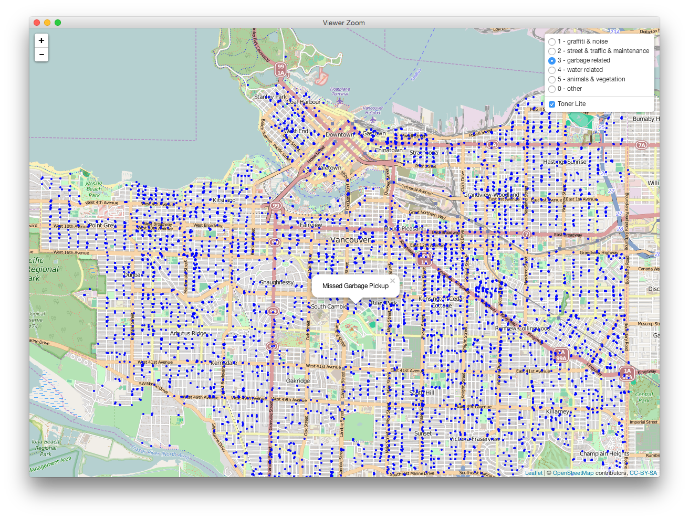
So we were able to make a functioning little web app, but we notice our code had some redundancies and make it hard to change colors and things. What do we do when we have redundancy? How about loops?!

We already subset our data from before:

	# subset out your data_filter:
	df_graffiti_noise = subset(data_filter, cid == 1)
	df_street_traffic_maint = subset(data_filter, cid == 2)
	df_garbage_recycling_organics = subset(data_filter, cid == 3)
	df_water = subset(data_filter, cid == 4)
	df_animal_vegetation = subset(data_filter, cid == 5)
	df_other = subset(data_filter, cid == 0)

Now we're going to put those variables into a **list** so we can loop through them:
	
	data_filterlist = list(df_graffiti_noise = subset(data_filter, cid == 1),
	                df_street_traffic_maint = subset(data_filter, cid == 2),
	                df_garbage_recycling_organics = subset(data_filter, cid == 3),
	                df_water = subset(data_filter, cid == 4),
	                df_animal_vegetation = subset(data_filter, cid == 5),
	                df_other = subset(data_filter, cid == 0))

Remember we also had these groups associated with each variable? Let's put them in a list too:

	layerlist = c("1 - graffiti & noise", "2 - street & traffic & maintenance",
	              "3 - garbage related","4 - water related", "5 - animals & vegetation",
	              "0 - other")

We can keep that same color variable:

	colorFactors = colorFactor(c('red', 'orange', 'purple', 'blue', 'pink', 'brown'), domain=data_filter$cid)

Now we have our loop - each time through the loop, it is adding our markers to the map object: 

	for (i in 1:length(data_filterlist)){
	  m = addCircleMarkers(m, 
	                        lng=data_filterlist[[i]]$lon_offset,
	                        lat=data_filterlist[[i]]$lat_offset, 
	                        popup=data_filterlist[[i]]$Case_Type, 
	                        radius=2,
	                        stroke = FALSE, 
	                        fillOpacity = 0.75,
	                        color = colorFactors(data_filterlist[[i]]$cid),
	                        group = layerlist[i]
	              )
	  
	}

Now this time we flip "overlayGroups" and "baseGroups" so that we can get the radiobutton functionality - that way only 1 category of calls are shown: 

	m = addTiles(m, "Stamen.TonerLite", group = "Toner Lite") 
	m = addLayersControl(m,
	                      overlayGroups = c("Toner Lite"),
	                      baseGroups = layerlist
	                      )
	m

## Version 3: Working with Polygons
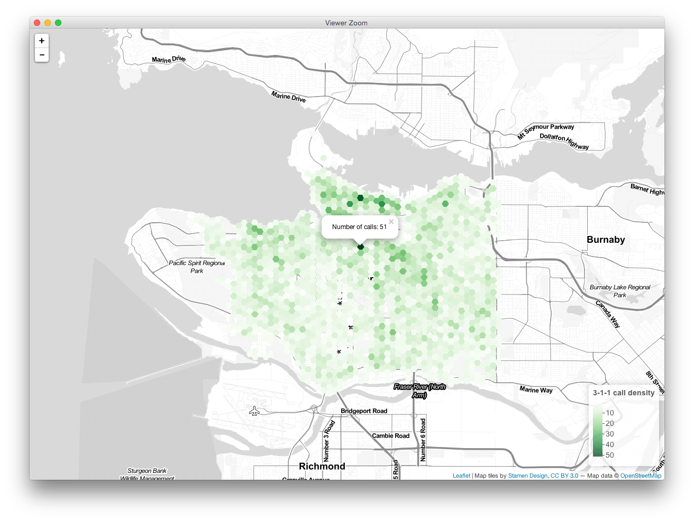

Remember we creates that hexagonal grid to aggregate our data to? Well, let's work with it to get a general impression of the call density across the city:

If you haven't already, you should have the **rgdal** and the **GISTools** libraries loaded:

	library(rgdal)
	library(GISTools)

Now we need to read in our hexgrid we aggregted our data to:

	# define the filepath
	hex_1401_fn = '/Users/Jozo/Projects/Github-local/Workshop/aloha-r/data_filter/calls_2014/shp/hgrid_250m_1401_counts.geojson'
	
	# read in the geojson
	hex_1401 = readOGR(hex_1401_fn, "OGRGeoJSON")

Now initiate a new map object:

	m = leaflet()
	m = addProviderTiles(m, "Stamen.TonerLite", group = "Toner Lite") 

Like any choropleth map, we need to set a color scale. We can do so by using the **colorNumeric()** function which is part of the R leaflet package:

	# Create a continuous palette function
	pal = colorNumeric(
	  palette = "Greens",
	  domain = hex_1401$data
	)

We use the "Greens" color and set the "domain" to the column called "data" in our geojson file.

Here's the **exciting stuff**. Let's add our polygon to the map:

	m = addPolygons(m, 
	                data = hex_1401,
	                stroke = FALSE, 
	                smoothFactor = 0.2, 
	                fillOpacity = 1,
	                color = ~pal(hex_1401$data),
	                popup= paste("Number of calls: ",hex_1401$data, sep="")
	                )
	              
let's break this down:

* **m**: this is our map object
* **data**: this is our spatialPolygonsDataframe
* **smoothFactor**: addoing some smooth operator
* **fillOpacity**: a cheeky 'ol fill opacity
* **color**: we let our **colorNumeric()**function handle the color
* **popup**: we set popup on click to our call density

And what good is a choropleth map without a legend? Let's add one using the **addLegend()** function:

	m = addLegend(m, "bottomright", pal = pal, values = hex_1401$data,
	              title = "3-1-1 call density",
	              labFormat = labelFormat(prefix = " "),
	              opacity = 0.75
	)
	
	print(m)

***
## Version 3: Synthesis

Now that we've got the two pieces of our map - toggleable & clickable point layers and hex grid - let's put them together. 

	# initiate leaflet map layer
	m = leaflet()
	m = addProviderTiles(m, "Stamen.TonerLite", group = "Toner Lite") 

	# --- hex grid --- #
	# store the file name of the geojson hex grid
	hex_1401_fn = '/Users/Jozo/Projects/Github-local/Workshop/aloha-r/data/calls_2014/shp/hgrid_250m_1401_counts.geojson'
	
	# read in the data
	hex_1401 = readOGR(hex_1401_fn, "OGRGeoJSON")
	
	# Create a continuous palette function
	pal = colorNumeric(
	  palette = "Greens",
	  domain = hex_1401$data
	)
	
	# add hex grid
	m = addPolygons(m, 
	                data = hex_1401,
	                stroke = FALSE, 
	                smoothFactor = 0.2, 
	                fillOpacity = 1,
	                color = ~pal(hex_1401$data),
	                popup= paste("Number of calls: ",hex_1401$data, sep=""),
	                group = "hex"
	)
	
	# add legend
	m = addLegend(m, "bottomright", pal = pal, values = hex_1401$data,
	              title = "3-1-1 call density",
	              labFormat = labelFormat(prefix = " "),
	              opacity = 0.75
	)
	
	# --- points data --- #
	
	# subset out your data:
	df_graffiti_noise = subset(data_filter, cid == 1)
	df_street_traffic_maint = subset(data_filter, cid == 2)
	df_garbage_recycling_organics = subset(data_filter, cid == 3)
	df_water = subset(data_filter, cid == 4)
	df_animal_vegetation = subset(data_filter, cid == 5)
	df_other = subset(data_filter, cid == 0)
	
	data_filterlist = list(df_graffiti_noise = subset(data_filter, cid == 1),
	                df_street_traffic_maint = subset(data_filter, cid == 2),
	                df_garbage_recycling_organics = subset(data_filter, cid == 3),
	                df_water = subset(data_filter, cid == 4),
	                df_animal_vegetation = subset(data_filter, cid == 5),
	                df_other = subset(data_filter, cid == 0))
	layerlist = c("1 - graffiti & noise", "2 - street & traffic & maintenance",
	              "3 - garbage related","4 - water related", "5 - animals & vegetation",
	              "0 - other")

	
	colorFactors = colorFactor(c('red', 'orange', 'purple', 'blue', 'pink', 'brown'), domain=data_filter$cid)
	for (i in 1:length(data_filterlist)){
	  m = addCircleMarkers(m, 
	                       lng=data_filterlist[[i]]$lon_offset, lat=data_filterlist[[i]]$lat_offset, 
	                       popup=data_filterlist[[i]]$Case_Type, 
	                       radius=2,
	                       stroke = FALSE, fillOpacity = 0.75,
	                       color = colorFactors(data_filterlist[[i]]$cid),
	                       group = layerlist[i]
	  )
	  
	}
	
	
	m = addLayersControl(m,
	                     overlayGroups = c("Toner Lite", "hex"),
	                     baseGroups = layerlist
	)
	
	# show map
	print(m)

***Congratulations you just made your first super awesome and fully functional web map using R!***

**Now, play with oyur maps and try to identify weaknesses and strengths of your map. Are the colors appropriate? could they be bettter? what's missing? REFINE YOUR STUFF**

***
# Review:
***
In this tutorial we covered a lot of ground. We're neither masters of R nor data viz experts, however we got the chance to go through the entire data viz pipeline:

* acquire: pulled 3-1-1 data from github
* parse: manipulted table data and geocoded the data
* filter: removed points that fell outside of the bounding box of vancouver
* mine: classified the data & added jitter
* represent: web mapping
* refine: web mapping
* interact: web mapping

## What's Next:
Right now our maps can only live on our computers, but we will have to learn how to put them onto the internet. For now, continue exploring locally, but keep in mind that the next step is to get these things on the web.
